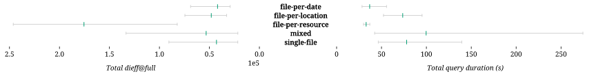
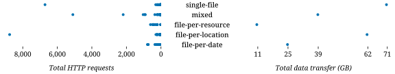

### Successful queries

| Combination | D-1 | D-2 | D-3 | D-4 | D-5 | D-6 | D-7 | D-8 | S-1 | S-2 | S-3 | S-4 | S-5 | S-6 | S-7 | Total |
| - | -: | -: | -: | -: | -: | -: | -: | -: | -: | -: | -: | -: | -: | -: | -: | -: |
| file-per-date | 5 | 5 | 5 | 5 | 5 | 5 | 5 | 0 | 5 | 0 | 0 | 5 | 5 | 0 | 0 | 50 |
| file-per-location | 5 | 5 | 5 | 5 | 5 | 5 | 3 | 0 | 5 | 0 | 0 | 5 | 5 | 0 | 0 | 48 |
| file-per-resource | 2 | 2 | 2 | 2 | 2 | 2 | 2 | 0 | 5 | 0 | 0 | 5 | 5 | 5 | 0 | 34 |
| mixed | 5 | 5 | 5 | 5 | 5 | 5 | 4 | 0 | 5 | 0 | 0 | 5 | 5 | 0 | 0 | 49 |
| single-file | 5 | 5 | 5 | 5 | 5 | 5 | 4 | 1 | 4 | 0 | 0 | 5 | 5 | 0 | 0 | 49 |

### Query processing

| Combination | *dieff@full* | *dieff@full* min | *dieff@full* max | Duration | Duration min | Duration max | First result | First result min | First result max | Last result | Last result min | Last result max | Queries | Results |
| - | -: | -: | -: | -: | -: | -: | -: | -: | -: | -: | -: | -: | -: | -: |
| file-per-date | 41854.300 | 29249.000 | 68784.500 | 36.845 | 28.340 | 55.654 | 28.661 | 20.909 | 46.536 | 31.347 | 23.549 | 49.350 | 27 | 741 |
| file-per-location | 48133.700 | 32783.500 | 74505.500 | 73.644 | 52.262 | 95.172 | 22.830 | 12.174 | 55.495 | 24.754 | 14.204 | 57.471 | 27 | 741 |
| file-per-resource | 175480.500 | 82197.000 | 246186.000 | 32.901 | 30.028 | 36.963 | 21.394 | 18.092 | 26.014 | 27.769 | 24.686 | 31.898 | 27 | 741 |
| mixed | 53257.900 | 21584.500 | 133400.500 | 99.727 | 42.414 | 274.366 | 46.915 | 10.680 | 147.512 | 48.787 | 11.848 | 151.969 | 27 | 741 |
| single-file | 42921.300 | 21644.000 | 90497.500 | 78.019 | 46.452 | 139.502 | 26.325 | 11.472 | 80.779 | 27.662 | 13.037 | 81.921 | 27 | 741 |

### Network usage

| Combination | HTTP requests | HTTP requests min | HTTP requests max | Total data transfer (GB) | Queries |
| - | -: | -: | -: | -: | -: |
| file-per-date | 5969 | 5412 | 6918 | 56.096 | 27 |
| file-per-location | 10918 | 8741 | 13472 | 127.548 | 27 |
| file-per-resource | 6114 | 6114 | 6114 | 23.295 | 27 |
| mixed | 11772 | 6770 | 27987 | 83.457 | 27 |
| single-file | 8510 | 6136 | 11719 | 144.266 | 27 |

### Resource usage

| Combination | Total duration (s) | Total CPU-seconds (%) | Total GB-seconds | Queries |
| - | -: | -: | -: | -: |
| file-per-date | 20946 | 404740 | 104894 | 75 |
| file-per-location | 23401 | 418203 | 146904 | 75 |
| file-per-resource | 15777 | 236666 | 38286 | 75 |
| mixed | 26333 | 516173 | 211848 | 75 |
| single-file | 25026 | 440011 | 182217 | 75 |