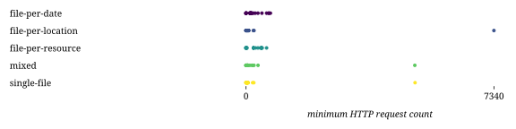

## Combinations

| Combination | Duration (s) | First result (s) | Last result (s) | dieff@full | HTTP requests | CPU-seconds (%) | GB-seconds | Network ingress (GB) | Network egress (GB) | Total results |
|:-|-:|-:|-:|-:|-:|-:|-:|-:|-:|-:|
| file-per-date | 1.37 | 1.17 | 1.26 | 1.50 | 223.13 | 278964.83 | 73650.53 | 24.77 | 3.28 | 742.00 |
| file-per-location | 2.59 | 1.10 | 1.16 | 1.77 | 375.93 | 91165.39 | 26421.13 | 2.15 | 61.62 | 742.00 |
| file-per-resource | 1.11 | 0.87 | 1.08 | 5.93 | 206.19 | 160722.59 | 22745.97 | 10.56 | 1.09 | 742.00 |
| mixed | 3.57 | 1.86 | 1.92 | 1.92 | 414.19 | 106825.83 | 33327.24 | 2.90 | 38.82 | 742.00 |
| single-file | 2.66 | 1.18 | 1.22 | 1.59 | 290.21 | 77507.65 | 24566.79 | 1.52 | 70.61 | 742.00 |

## templates

## combinations

## httprequests

## diefficiency

## timestamps

## durations

## resources

