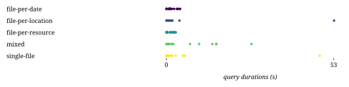

## Combinations

| Combination | Duration min (s) | Duration avg (s) | Duration max (s) | First result min (s) | First result avg (s) | First result max (s) | Last result min (s) | Last result avg (s) | Last result max (s) | dieff@full min | dieff@full avg | dieff@full max | HTTP requests | CPU-seconds (%) | GB-seconds | Network ingress (GB) | Network egress (GB) | Total results | Queries faster than baseline | Queries slower than baseline | Queries finished |
| -: | -: | -: | -: | -: | -: | -: | -: | -: | -: | -: | -: | -: | -: | -: | -: | -: | -: | -: | -: | -: | -: |
| file-per-date | 0.00 | 1.37 | 4.35 | 0.02 | 1.17 | 12.21 | 0.02 | 1.26 | 12.21 | 0.01 | 1.50 | 31.25 | 223 | 278965 | 73651 | 25 | 3 | 742 | 0 | 0 | 60 / 75 |
| file-per-location | 0.00 | 2.59 | 53.12 | 0.09 | 1.10 | 28.62 | 0.09 | 1.16 | 28.62 | 0.05 | 1.77 | 21.19 | 376 | 327037 | 120483 | 62 | 2 | 742 | 0 | 0 | 56 / 75 |
| file-per-resource | 0.00 | 1.11 | 3.00 | 0.03 | 0.87 | 4.79 | 0.03 | 1.08 | 4.79 | 0.01 | 5.93 | 174.55 | 206 | 160723 | 22746 | 11 | 1 | 742 | 0 | 0 | 46 / 75 |
| mixed | 0.00 | 3.57 | 26.97 | 0.03 | 1.86 | 44.34 | 0.03 | 1.92 | 44.34 | 0.01 | 1.92 | 35.11 | 414 | 409347 | 178520 | 39 | 3 | 742 | 0 | 0 | 61 / 75 |
| single-file | 0.00 | 2.66 | 48.56 | 0.09 | 1.18 | 26.86 | 0.09 | 1.22 | 26.86 | 0.04 | 1.59 | 29.19 | 290 | 362504 | 157650 | 71 | 2 | 742 | 0 | 0 | 58 / 75 |

## templates

## combinations

## httprequests

## diefficiency

## timestamps

## durations

## queries

## resources

