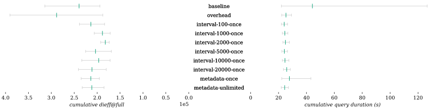

| Combination | Δ *dieff@full* | Δ *dieff@full* min | Δ *dieff@full* max | Δ duration | Δ duration min | Δ duration max | Δ first result | Δ first result min | Δ first result max | Δ last result | Δ last result min | Δ last result max | Queries |
| - | -: | -: | -: | -: | -: | -: | -: | -: | -: | -: | -: | -: | -: |
| baseline |  |  |  |  |  |  |  |  |  |  |  |  | 24 |
| overhead | +20.49% | **-3.30**% | +24.23% | **-42.80**% | +1.07% | **-76.88**% | **-3.55**% | **-0.02**% | **-10.67**% | +0.58% | +2.48% | **-7.35**% | 24 |
| interval-100-once | **-10.73**% | **-5.26**% | **-24.05**% | **-45.69**% | +0.05% | **-79.12**% | **-7.23**% | **-6.76**% | **-13.34**% | **-2.22**% | +2.98% | **-10.77**% | 24 |
| interval-1000-once | **-21.30**% | **-11.60**% | **-34.37**% | **-44.64**% | +3.02% | **-78.93**% | **-4.23**% | **-2.26**% | **-12.51**% | +0.45% | +6.38% | **-10.72**% | 24 |
| interval-2000-once | **-23.90**% | **-10.52**% | **-38.82**% | **-43.72**% | +5.03% | **-78.05**% | +1.11% | +6.80% | **-7.01**% | **-2.28**% | +4.73% | **-12.20**% | 24 |
| interval-5000-once | **-14.99**% | **-12.94**% | **-28.34**% | **-45.47**% | +1.53% | **-79.15**% | **-6.92**% | **-1.50**% | **-20.14**% | **-5.78**% | +0.61% | **-17.53**% | 24 |
| interval-10000-once | **-17.92**% | **-11.51**% | **-25.67**% | **-44.42**% | +2.97% | **-78.35**% | **-3.69**% | +0.58% | **-13.51**% | **-3.85**% | +2.08% | **-14.29**% | 24 |
| interval-20000-once | **-11.74**% | **-7.14**% | **-23.35**% | **-41.66**% | +6.70% | **-77.55**% | +7.06% | +9.51% | **-6.47**% | +3.45% | +7.06% | **-8.87**% | 24 |
| metadata-once | **-10.70**% | +0.55% | **-25.25**% | **-37.29**% | +1.19% | **-65.89**% | +9.45% | **-5.29**% | +45.23% | +7.21% | +1.67% | +29.67% | 24 |
| metadata-unlimited | **-11.62**% | **-4.67**% | **-26.01**% | **-44.94**% | **-0.35**% | **-78.63**% | **-6.14**% | **-3.01**% | **-15.58**% | **-1.66**% | +3.27% | **-12.07**% | 24 |
