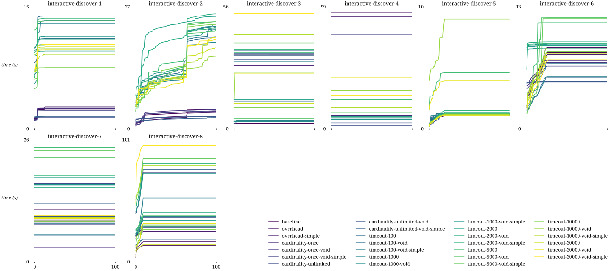
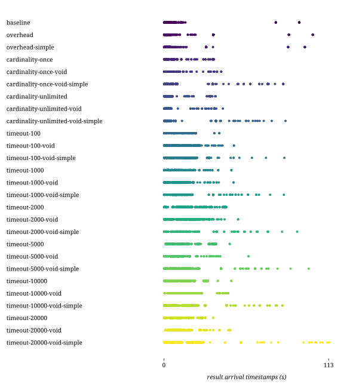
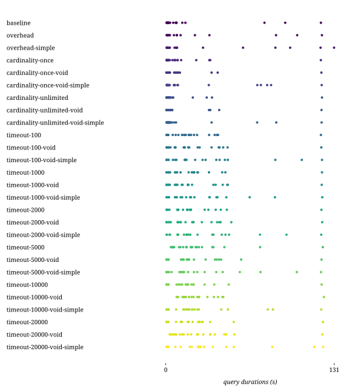

## Combinations

| Combination | Duration (s) | First result (s) | Last result (s) | dieff@full | HTTP requests | CPU-seconds (%) | GB-seconds | Network ingress (GB) | Network egress (GB) | Total results |
|:-|-:|-:|-:|-:|-:|-:|-:|-:|-:|-:|
| baseline | 17.09 | 9.38 | 11.64 | 39.34 | 70.86 | 473116.97 | 14121.38 | 16.08 | 0.36 | 633.00 |
| overhead | 19.82 | 11.48 | 14.21 | 42.54 | 73.64 | 571665.54 | 16330.03 | 15.47 | 0.34 | 633.00 |
| overhead-simple | 26.40 | 12.49 | 14.32 | 46.64 | 64.09 | 619020.72 | 19414.20 | 15.04 | 0.34 | 624.00 |
| cardinality-once | 13.00 | 5.45 | 7.30 | 23.56 | 131.18 | 490636.68 | 18387.78 | 19.48 | 0.43 | 633.00 |
| cardinality-once-void | 12.53 | 4.17 | 6.92 | 30.13 | 141.50 | 127263.08 | 3082.59 | 0.35 | 17.80 | 633.00 |
| cardinality-once-void-simple | 23.47 | 13.15 | 17.60 | 50.47 | 149.05 | 123663.39 | 3071.14 | 0.38 | 18.83 | 633.00 |
| cardinality-unlimited | 11.46 | 5.15 | 6.55 | 26.37 | 143.95 | 188840.52 | 3486.69 | 0.50 | 21.49 | 633.00 |
| cardinality-unlimited-void | 12.42 | 5.39 | 7.20 | 21.34 | 139.27 | 495180.21 | 17388.96 | 15.59 | 0.30 | 633.00 |
| cardinality-unlimited-void-simple | 16.59 | 7.45 | 11.18 | 39.33 | 150.86 | 99446.65 | 2709.45 | 0.30 | 15.47 | 633.00 |
| timeout-100 | 20.88 | 6.19 | 11.72 | 173.81 | 71.18 | 336034.88 | 13096.80 | 14.10 | 0.29 | 633.00 |
| timeout-100-void | 22.49 | 6.41 | 13.06 | 247.89 | 137.41 | 361008.17 | 14321.89 | 14.13 | 0.28 | 633.00 |
| timeout-100-void-simple | 29.94 | 7.20 | 16.13 | 243.85 | 142.64 | 440101.53 | 17605.28 | 13.98 | 0.29 | 633.00 |
| timeout-1000 | 21.17 | 6.85 | 12.40 | 182.83 | 153.14 | 118592.33 | 2575.39 | 0.35 | 16.43 | 631.00 |
| timeout-1000-void | 21.71 | 7.11 | 13.29 | 200.93 | 148.41 | 347986.00 | 14764.43 | 16.64 | 0.34 | 633.00 |
| timeout-1000-void-simple | 27.18 | 9.65 | 18.03 | 235.98 | 156.77 | 414765.73 | 18121.71 | 15.94 | 0.32 | 633.00 |
| timeout-2000 | 22.24 | 8.79 | 14.15 | 111.14 | 163.00 | 352760.40 | 15949.49 | 16.91 | 0.34 | 633.00 |
| timeout-2000-void | 22.79 | 7.91 | 14.51 | 153.83 | 155.95 | 351397.82 | 15430.00 | 16.01 | 0.32 | 633.00 |
| timeout-2000-void-simple | 29.32 | 10.80 | 20.05 | 252.78 | 150.86 | 421371.51 | 18131.35 | 16.35 | 0.33 | 633.00 |
| timeout-5000 | 25.89 | 9.72 | 17.02 | 211.57 | 162.91 | 359668.92 | 18178.45 | 18.62 | 0.41 | 633.00 |
| timeout-5000-void | 24.37 | 8.54 | 14.76 | 205.88 | 166.64 | 368248.50 | 17122.51 | 17.11 | 0.35 | 633.00 |
| timeout-5000-void-simple | 28.08 | 11.09 | 20.01 | 289.50 | 176.23 | 107671.82 | 2631.32 | 0.31 | 15.84 | 633.00 |
| timeout-10000 | 20.15 | 5.70 | 12.58 | 225.66 | 177.55 | 135402.77 | 2916.91 | 0.40 | 17.97 | 633.00 |
| timeout-10000-void | 26.55 | 8.78 | 15.49 | 154.66 | 172.68 | 377716.81 | 18279.12 | 17.35 | 0.40 | 633.00 |
| timeout-10000-void-simple | 27.27 | 11.75 | 18.62 | 229.80 | 177.36 | 450802.09 | 21780.76 | 17.70 | 0.35 | 633.00 |
| timeout-20000 | 22.47 | 6.52 | 12.32 | 203.51 | 78.05 | 146315.94 | 3427.12 | 0.40 | 17.82 | 633.00 |
| timeout-20000-void | 26.71 | 9.38 | 16.77 | 263.86 | 105.68 | 390076.54 | 19480.17 | 18.23 | 0.43 | 633.00 |
| timeout-20000-void-simple | 32.30 | 12.59 | 21.85 | 233.70 | 84.36 | 465739.08 | 22848.33 | 17.06 | 0.36 | 630.00 |

## templates

## combinations

## httprequests

## diefficiency

## timestamps

## durations

## resources

