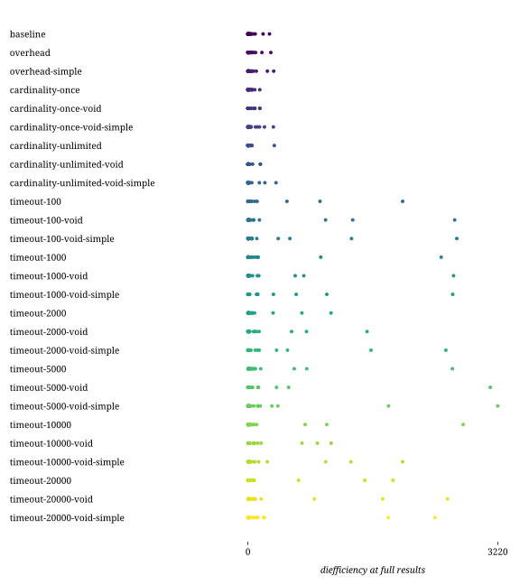

## Combinations

| Combination | Duration min (s) | Duration avg (s) | Duration max (s) | First result min (s) | First result avg (s) | First result max (s) | Last result min (s) | Last result avg (s) | Last result max (s) | dieff@full min | dieff@full avg | dieff@full max | HTTP requests | CPU-seconds (%) | GB-seconds | Network ingress (GB) | Network egress (GB) | Total results | Queries faster than baseline | Queries slower than baseline | Queries finished |
| -: | -: | -: | -: | -: | -: | -: | -: | -: | -: | -: | -: | -: | -: | -: | -: | -: | -: | -: | -: | -: | -: |
| baseline | 0.58 | 17.09 | 120.62 | 0.18 | 9.38 | 92.88 | 0.34 | 11.64 | 92.88 | 0.45 | 39.34 | 277.73 | 71 | 473117 | 14121 | 16 | 0 | 633 | 0 | 0 | 60 / 75 |
| overhead | 0.75 | 19.82 | 121.42 | 0.15 | 11.48 | 102.17 | 0.30 | 14.21 | 102.17 | 0.22 | 42.54 | 295.37 | 74 | 571666 | 16330 | 15 | 0 | 633 | 5 | 17 | 58 / 75 |
| overhead-simple | 0.70 | 26.40 | 130.85 | 0.15 | 12.49 | 96.70 | 0.20 | 14.32 | 96.70 | 0.15 | 46.64 | 332.30 | 64 | 619021 | 19414 | 15 | 0 | 624 | 5 | 17 | 57 / 75 |
| cardinality-once | 0.60 | 13.00 | 120.58 | 0.15 | 5.45 | 33.84 | 0.30 | 7.30 | 34.41 | 0.30 | 23.56 | 152.69 | 131 | 490637 | 18388 | 19 | 0 | 633 | 15 | 7 | 58 / 75 |
| cardinality-once-void | 0.50 | 12.53 | 121.01 | 0.12 | 4.17 | 30.55 | 0.36 | 6.92 | 39.33 | 0.25 | 30.13 | 154.92 | 142 | 469028 | 16028 | 18 | 0 | 633 | 13 | 9 | 56 / 75 |
| cardinality-once-void-simple | 0.72 | 23.47 | 121.21 | 0.17 | 13.15 | 81.87 | 0.37 | 17.60 | 81.87 | 0.36 | 50.47 | 328.09 | 149 | 528995 | 19442 | 19 | 0 | 633 | 9 | 13 | 54 / 75 |
| cardinality-unlimited | 0.54 | 11.46 | 121.48 | 0.10 | 5.15 | 31.84 | 0.10 | 6.55 | 35.56 | 0.05 | 26.37 | 339.68 | 144 | 442391 | 17154 | 21 | 1 | 633 | 13 | 9 | 58 / 75 |
| cardinality-unlimited-void | 0.51 | 12.42 | 121.06 | 0.13 | 5.39 | 34.63 | 0.31 | 7.20 | 40.48 | 0.21 | 21.34 | 161.23 | 139 | 495180 | 17389 | 16 | 0 | 633 | 14 | 8 | 52 / 75 |
| cardinality-unlimited-void-simple | 0.57 | 16.59 | 121.17 | 0.17 | 7.45 | 47.68 | 0.34 | 11.18 | 83.43 | 0.48 | 39.33 | 361.89 | 151 | 509011 | 18999 | 15 | 0 | 633 | 11 | 11 | 49 / 75 |
| timeout-100 | 0.54 | 20.88 | 120.61 | 0.11 | 6.19 | 15.23 | 0.32 | 11.72 | 38.02 | 0.33 | 173.81 | 1994.61 | 71 | 336035 | 13097 | 14 | 0 | 633 | 8 | 14 | 43 / 75 |
| timeout-100-void | 0.69 | 22.49 | 120.92 | 0.15 | 6.41 | 28.52 | 0.32 | 13.06 | 48.06 | 0.45 | 247.89 | 2664.83 | 137 | 361008 | 14322 | 14 | 0 | 633 | 5 | 17 | 43 / 75 |
| timeout-100-void-simple | 0.60 | 29.94 | 121.50 | 0.12 | 7.20 | 31.00 | 0.35 | 16.13 | 82.66 | 0.33 | 243.85 | 2692.14 | 143 | 440102 | 17605 | 14 | 0 | 633 | 6 | 16 | 41 / 75 |
| timeout-1000 | 0.60 | 21.17 | 121.47 | 0.15 | 6.85 | 27.36 | 0.23 | 12.40 | 46.33 | 0.15 | 182.83 | 2490.69 | 153 | 346559 | 14316 | 16 | 0 | 631 | 4 | 18 | 35 / 75 |
| timeout-1000-void | 0.58 | 21.71 | 121.26 | 0.10 | 7.11 | 28.01 | 0.25 | 13.29 | 47.80 | 0.29 | 200.93 | 2651.13 | 148 | 347986 | 14764 | 17 | 0 | 633 | 5 | 17 | 41 / 75 |
| timeout-1000-void-simple | 0.63 | 27.18 | 121.66 | 0.10 | 9.65 | 45.30 | 0.30 | 18.03 | 82.30 | 0.42 | 235.98 | 2639.49 | 157 | 414766 | 18122 | 16 | 0 | 633 | 4 | 18 | 40 / 75 |
| timeout-2000 | 0.64 | 22.24 | 121.04 | 0.15 | 8.79 | 31.70 | 0.35 | 14.15 | 42.77 | 0.27 | 111.14 | 1071.08 | 163 | 352760 | 15949 | 17 | 0 | 633 | 4 | 18 | 42 / 75 |
| timeout-2000-void | 0.52 | 22.79 | 121.62 | 0.12 | 7.91 | 29.32 | 0.26 | 14.51 | 50.91 | 0.27 | 153.83 | 1535.62 | 156 | 351398 | 15430 | 16 | 0 | 633 | 5 | 17 | 44 / 75 |
| timeout-2000-void-simple | 0.67 | 29.32 | 120.86 | 0.16 | 10.80 | 50.90 | 0.22 | 20.05 | 91.43 | 0.17 | 252.78 | 2551.38 | 151 | 421372 | 18131 | 16 | 0 | 633 | 4 | 18 | 45 / 75 |
| timeout-5000 | 4.00 | 25.89 | 122.11 | 1.28 | 9.72 | 34.86 | 1.67 | 17.02 | 45.24 | 0.85 | 211.57 | 2635.69 | 163 | 359669 | 18178 | 19 | 0 | 633 | 2 | 20 | 43 / 75 |
| timeout-5000-void | 0.53 | 24.37 | 121.09 | 0.17 | 8.54 | 31.24 | 0.34 | 14.76 | 58.13 | 0.33 | 205.88 | 3124.19 | 167 | 368248 | 17123 | 17 | 0 | 633 | 5 | 17 | 46 / 75 |
| timeout-5000-void-simple | 0.58 | 28.08 | 120.70 | 0.12 | 11.09 | 54.23 | 0.40 | 20.01 | 99.32 | 0.57 | 289.50 | 3220.33 | 176 | 419658 | 19540 | 16 | 0 | 633 | 5 | 17 | 42 / 75 |
| timeout-10000 | 0.58 | 20.15 | 121.16 | 0.12 | 5.70 | 17.44 | 0.28 | 12.58 | 46.33 | 0.26 | 225.66 | 2774.29 | 178 | 362557 | 17839 | 18 | 0 | 633 | 4 | 18 | 49 / 75 |
| timeout-10000-void | 8.46 | 26.55 | 122.95 | 0.54 | 8.78 | 44.08 | 4.25 | 15.49 | 44.08 | 2.13 | 154.66 | 1072.59 | 173 | 377717 | 18279 | 17 | 0 | 633 | 2 | 20 | 51 / 75 |
| timeout-10000-void-simple | 0.62 | 27.27 | 120.87 | 0.17 | 11.75 | 61.78 | 0.28 | 18.62 | 81.32 | 0.25 | 229.80 | 1993.16 | 177 | 450802 | 21781 | 18 | 0 | 633 | 5 | 17 | 44 / 75 |
| timeout-20000 | 0.51 | 22.47 | 122.20 | 0.14 | 6.52 | 28.36 | 0.26 | 12.32 | 33.83 | 0.23 | 203.51 | 1869.67 | 78 | 352957 | 16314 | 18 | 0 | 633 | 8 | 14 | 59 / 75 |
| timeout-20000-void | 3.09 | 26.71 | 121.82 | 0.92 | 9.38 | 45.52 | 2.17 | 16.77 | 45.52 | 2.01 | 263.86 | 2571.66 | 106 | 390077 | 19480 | 18 | 0 | 633 | 2 | 20 | 56 / 75 |
| timeout-20000-void-simple | 0.53 | 32.30 | 122.35 | 0.17 | 12.59 | 64.11 | 0.26 | 21.85 | 113.46 | 0.23 | 233.70 | 2408.70 | 84 | 465739 | 22848 | 17 | 0 | 630 | 7 | 15 | 43 / 75 |

## templates

## combinations

## httprequests

## diefficiency

## timestamps

## durations

## queries

## resources

