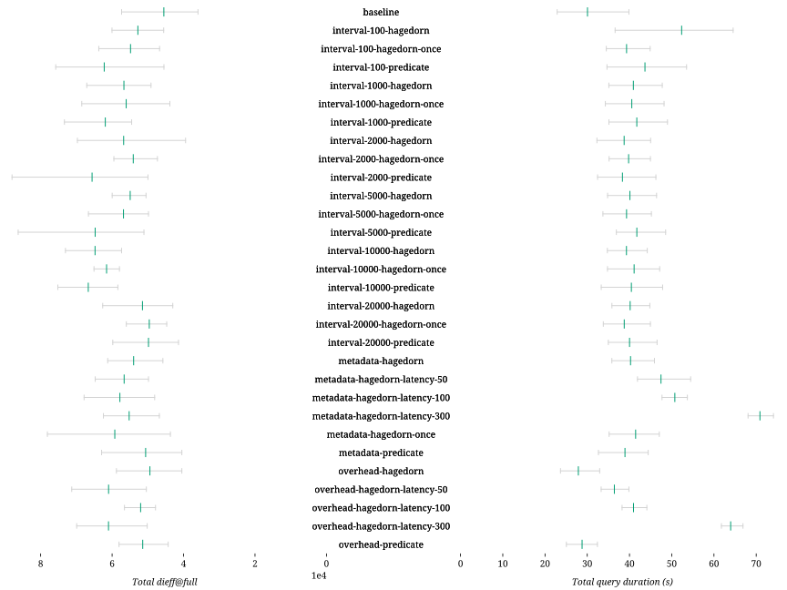

### Successful queries

| Combination | D-1 | D-2 | D-3 | D-4 | D-5 | D-6 | D-7 | D-8 | S-1 | S-2 | S-3 | S-4 | S-5 | S-6 | S-7 | Total |
| - | -: | -: | -: | -: | -: | -: | -: | -: | -: | -: | -: | -: | -: | -: | -: | -: |
| baseline | 5 | 5 | 5 | 5 | 5 | 3 | 3 | 1 | 5 | 0 | 0 | 5 | 5 | 0 | 0 | 47 |
| interval-100-hagedorn | 4 | 5 | 5 | 4 | 5 | 3 | 3 | 0 | 5 | 0 | 0 | 5 | 5 | 0 | 0 | 44 |
| interval-100-hagedorn-once | 5 | 5 | 5 | 3 | 5 | 3 | 3 | 0 | 4 | 0 | 0 | 5 | 5 | 0 | 0 | 43 |
| interval-100-predicate | 5 | 3 | 3 | 1 | 5 | 4 | 3 | 0 | 4 | 0 | 0 | 5 | 5 | 0 | 0 | 38 |
| interval-1000-hagedorn | 5 | 5 | 2 | 5 | 5 | 3 | 3 | 0 | 4 | 0 | 0 | 5 | 4 | 0 | 0 | 41 |
| interval-1000-hagedorn-once | 5 | 5 | 3 | 5 | 5 | 3 | 3 | 0 | 4 | 0 | 0 | 5 | 4 | 0 | 0 | 42 |
| interval-1000-predicate | 5 | 5 | 0 | 4 | 5 | 3 | 3 | 0 | 4 | 0 | 0 | 5 | 5 | 0 | 0 | 39 |
| interval-2000-hagedorn | 5 | 5 | 2 | 5 | 5 | 3 | 3 | 0 | 4 | 0 | 0 | 5 | 5 | 0 | 0 | 42 |
| interval-2000-hagedorn-once | 5 | 5 | 5 | 5 | 5 | 3 | 3 | 0 | 4 | 0 | 0 | 5 | 5 | 0 | 0 | 45 |
| interval-2000-predicate | 5 | 5 | 2 | 5 | 5 | 3 | 3 | 0 | 5 | 0 | 0 | 5 | 5 | 0 | 0 | 43 |
| interval-5000-hagedorn | 5 | 5 | 5 | 5 | 5 | 3 | 3 | 0 | 4 | 0 | 0 | 5 | 5 | 0 | 0 | 45 |
| interval-5000-hagedorn-once | 5 | 5 | 5 | 5 | 5 | 3 | 3 | 0 | 4 | 0 | 0 | 5 | 5 | 0 | 0 | 45 |
| interval-5000-predicate | 5 | 5 | 3 | 5 | 5 | 3 | 3 | 0 | 4 | 0 | 0 | 5 | 5 | 0 | 0 | 43 |
| interval-10000-hagedorn | 5 | 5 | 5 | 5 | 5 | 3 | 3 | 0 | 5 | 0 | 0 | 5 | 5 | 0 | 0 | 46 |
| interval-10000-hagedorn-once | 5 | 5 | 5 | 5 | 5 | 3 | 3 | 0 | 4 | 0 | 0 | 5 | 5 | 0 | 0 | 45 |
| interval-10000-predicate | 5 | 5 | 5 | 5 | 5 | 3 | 3 | 0 | 4 | 0 | 0 | 5 | 5 | 0 | 0 | 45 |
| interval-20000-hagedorn | 5 | 5 | 5 | 5 | 5 | 3 | 3 | 0 | 4 | 0 | 0 | 5 | 5 | 0 | 0 | 45 |
| interval-20000-hagedorn-once | 5 | 5 | 5 | 5 | 5 | 3 | 3 | 0 | 4 | 0 | 0 | 5 | 5 | 0 | 0 | 45 |
| interval-20000-predicate | 5 | 5 | 5 | 5 | 5 | 3 | 3 | 0 | 4 | 0 | 0 | 5 | 5 | 0 | 0 | 45 |
| metadata-hagedorn | 5 | 5 | 5 | 5 | 5 | 3 | 3 | 0 | 4 | 0 | 0 | 5 | 5 | 0 | 0 | 45 |
| metadata-hagedorn-latency-50 | 5 | 5 | 5 | 5 | 5 | 3 | 3 | 0 | 4 | 0 | 0 | 5 | 5 | 0 | 0 | 45 |
| metadata-hagedorn-latency-100 | 5 | 5 | 5 | 5 | 5 | 3 | 3 | 0 | 4 | 0 | 0 | 5 | 5 | 0 | 0 | 45 |
| metadata-hagedorn-latency-300 | 4 | 5 | 4 | 5 | 5 | 3 | 3 | 0 | 4 | 0 | 0 | 5 | 5 | 0 | 0 | 43 |
| metadata-hagedorn-once | 5 | 5 | 5 | 5 | 5 | 3 | 3 | 0 | 4 | 0 | 0 | 5 | 5 | 0 | 0 | 45 |
| metadata-predicate | 4 | 5 | 4 | 2 | 5 | 3 | 3 | 1 | 4 | 0 | 0 | 5 | 5 | 0 | 0 | 41 |
| overhead-hagedorn | 5 | 5 | 5 | 5 | 5 | 3 | 3 | 0 | 5 | 0 | 0 | 5 | 5 | 0 | 0 | 46 |
| overhead-hagedorn-latency-50 | 5 | 5 | 5 | 5 | 5 | 3 | 3 | 0 | 5 | 0 | 0 | 5 | 5 | 0 | 0 | 46 |
| overhead-hagedorn-latency-100 | 5 | 5 | 5 | 5 | 5 | 3 | 3 | 1 | 5 | 0 | 0 | 5 | 5 | 0 | 0 | 47 |
| overhead-hagedorn-latency-300 | 5 | 5 | 5 | 5 | 5 | 3 | 3 | 2 | 5 | 0 | 0 | 5 | 5 | 0 | 0 | 48 |
| overhead-predicate | 5 | 5 | 5 | 5 | 5 | 3 | 3 | 0 | 5 | 0 | 0 | 5 | 5 | 0 | 0 | 46 |

### Query processing

| Combination | Δ *dieff@full* | Δ *dieff@full* min | Δ *dieff@full* max | Δ duration | Δ duration min | Δ duration max | Δ first result | Δ first result min | Δ first result max | Δ last result | Δ last result min | Δ last result max | Queries | Results |
| - | -: | -: | -: | -: | -: | -: | -: | -: | -: | -: | -: | -: | -: | -: |
| baseline |  |  |  |  |  |  |  |  |  |  |  |  | 27 | 374 |
| interval-100-hagedorn | +15.97% | +26.70% | +4.69% | +74.17% | +59.97% | +61.89% | **-38.65**% | **-11.22**% | **-54.01**% | **-12.00**% | +17.08% | **-32.42**% | 27 | 378 |
| interval-100-hagedorn-once | +20.48% | +29.88% | +11.12% | +30.78% | +50.84% | +12.61% | **-34.70**% | **-9.34**% | **-50.92**% | **-9.65**% | +15.85% | **-27.78**% | 27 | 378 |
| interval-100-predicate | +36.67% | +26.50% | +32.14% | +45.27% | +51.55% | +34.23% | **-50.89**% | **-29.60**% | **-63.61**% | **-13.49**% | +8.57% | **-31.49**% | 27 | 389 |
| interval-1000-hagedorn | +24.55% | +36.58% | +16.98% | +36.13% | +53.51% | +19.79% | **-36.85**% | **-12.27**% | **-52.84**% | +3.89% | +44.60% | **-22.29**% | 27 | 377 |
| interval-1000-hagedorn-once | +23.16% | +21.89% | +19.44% | +34.90% | +49.87% | +20.86% | **-34.81**% | **-4.19**% | **-52.85**% | +1.74% | +33.47% | **-19.86**% | 27 | 377 |
| interval-1000-predicate | +36.01% | +51.63% | +27.91% | +38.85% | +53.60% | +22.88% | **-41.62**% | **-19.18**% | **-55.48**% | **-4.67**% | +26.03% | **-24.77**% | 27 | 377 |
| interval-2000-hagedorn | +24.72% | +9.66% | +21.56% | +28.87% | +41.15% | +12.89% | **-40.18**% | **-16.39**% | **-54.70**% | +0.22% | +34.09% | **-23.17**% | 27 | 376 |
| interval-2000-hagedorn-once | +18.81% | +31.57% | +3.76% | +32.40% | +53.73% | +12.78% | **-37.87**% | **-9.73**% | **-52.41**% | +0.79% | +40.78% | **-24.72**% | 27 | 376 |
| interval-2000-predicate | +44.14% | +38.94% | +53.49% | +27.53% | +41.83% | +16.01% | **-40.24**% | **-11.51**% | **-56.67**% | +2.16% | +42.43% | **-23.40**% | 27 | 376 |
| interval-5000-hagedorn | +20.69% | +40.45% | +4.59% | +33.43% | +52.17% | +16.41% | **-38.42**% | **-7.52**% | **-54.58**% | +8.91% | +57.00% | **-20.13**% | 27 | 375 |
| interval-5000-hagedorn-once | +24.83% | +38.53% | +16.17% | +30.77% | +47.36% | +13.34% | **-34.05**% | **-8.72**% | **-47.89**% | +11.28% | +52.05% | **-13.72**% | 27 | 375 |
| interval-5000-predicate | +42.24% | +42.07% | +50.49% | +38.88% | +61.26% | +21.79% | **-38.41**% | **-16.64**% | **-51.77**% | +10.80% | +48.16% | **-12.93**% | 27 | 375 |
| interval-10000-hagedorn | +42.31% | +59.47% | +27.40% | +30.69% | +51.96% | +10.89% | **-37.37**% | **-4.46**% | **-55.77**% | +45.57% | +114.47% | +2.76% | 27 | 375 |
| interval-10000-hagedorn-once | +35.22% | +61.13% | +13.47% | +36.73% | +52.09% | +18.25% | **-39.96**% | **-14.33**% | **-55.65**% | +43.83% | +109.92% | +2.18% | 27 | 375 |
| interval-10000-predicate | +46.47% | +62.38% | +31.12% | +34.58% | +45.61% | +20.02% | **-31.97**% | **-2.55**% | **-49.65**% | +53.46% | +121.01% | +10.80% | 27 | 375 |
| interval-20000-hagedorn | +13.16% | +19.62% | +9.22% | +33.61% | +56.68% | +12.41% | **-41.13**% | **-21.59**% | **-55.60**% | **-29.27**% | **-13.06**% | **-43.75**% | 27 | 374 |
| interval-20000-hagedorn-once | +8.96% | +24.35% | **-2.30**% | +28.94% | +47.76% | +12.74% | **-38.06**% | **-13.52**% | **-54.61**% | **-28.88**% | **-7.11**% | **-45.29**% | 27 | 374 |
| interval-20000-predicate | +9.45% | +15.18% | +4.30% | +33.13% | +52.97% | +16.70% | **-40.48**% | **-14.87**% | **-54.89**% | **-29.63**% | **-5.47**% | **-45.49**% | 27 | 374 |
| metadata-hagedorn | +18.58% | +27.33% | +6.78% | +33.93% | +56.61% | +15.17% | **-34.33**% | **-4.73**% | **-50.64**% | **-22.19**% | +1.05% | **-37.63**% | 27 | 374 |
| metadata-hagedorn-latency-50 | +24.42% | +38.53% | +12.88% | +57.90% | +83.13% | +36.67% | +25.48% | +105.00% | **-17.31**% | +24.10% | +79.50% | **-10.32**% | 27 | 374 |
| metadata-hagedorn-latency-100 | +27.04% | +33.72% | +18.31% | +68.81% | +108.52% | +34.70% | +75.69% | +192.13% | +14.26% | +64.07% | +141.20% | +15.43% | 27 | 374 |
| metadata-hagedorn-latency-300 | +21.33% | +30.07% | +8.88% | +135.86% | +197.58% | +85.84% | +262.60% | +521.95% | +128.69% | +205.16% | +363.16% | +107.73% | 27 | 374 |
| metadata-hagedorn-once | +30.16% | +21.47% | +36.22% | +37.92% | +53.80% | +18.03% | **-38.13**% | **-8.95**% | **-54.08**% | **-24.76**% | +0.71% | **-40.51**% | 27 | 374 |
| metadata-predicate | +11.20% | +12.56% | +9.76% | +29.53% | +42.75% | +11.44% | **-46.27**% | **-24.50**% | **-59.91**% | **-35.43**% | **-17.35**% | **-48.71**% | 27 | 380 |
| overhead-hagedorn | +8.57% | +12.57% | +2.53% | **-7.20**% | +3.45% | **-17.38**% | **-38.96**% | **-10.19**% | **-54.74**% | **-31.39**% | **-9.95**% | **-45.48**% | 27 | 374 |
| overhead-hagedorn-latency-50 | +33.99% | +40.20% | +24.33% | +21.16% | +45.52% | **-0.00**% | +20.69% | +101.94% | **-22.37**% | +20.95% | +78.49% | **-14.91**% | 27 | 374 |
| overhead-hagedorn-latency-100 | +14.28% | +33.07% | **-1.40**% | +36.25% | +67.18% | +10.64% | +72.61% | +185.74% | +12.13% | +59.17% | +138.35% | +9.94% | 27 | 374 |
| overhead-hagedorn-latency-300 | +34.03% | +39.53% | +21.91% | +112.80% | +170.00% | +67.74% | +256.22% | +509.31% | +124.03% | +196.64% | +354.57% | +101.00% | 27 | 374 |
| overhead-predicate | +12.99% | +23.20% | +1.25% | **-4.26**% | +9.52% | **-18.71**% | **-40.12**% | **-16.39**% | **-55.63**% | **-29.34**% | **-8.46**% | **-44.79**% | 27 | 374 |

### Network usage

| Combination | Δ HTTP requests | Δ HTTP requests min | Δ HTTP requests max | Δ total data transfer (GB) | Queries |
| - | -: | -: | -: | -: | -: |
| baseline |  |  |  |  | 27 |
| interval-100-hagedorn | +9% | **-1**% | +17% | **-15.59**% | 27 |
| interval-100-hagedorn-once | **-3**% | **-1**% | **-5**% | **-11.95**% | 27 |
| interval-100-predicate | +3% | **-1**% | +9% | **-6.66**% | 27 |
| interval-1000-hagedorn | **-2**% | **-1**% | **-2**% | **-4.77**% | 27 |
| interval-1000-hagedorn-once | **-3**% | **-1**% | **-5**% | **-6.94**% | 27 |
| interval-1000-predicate | **-2**% | **-1**% | **-4**% | **-6.91**% | 27 |
| interval-2000-hagedorn | **-3**% | **-1**% | **-5**% | **-5.57**% | 27 |
| interval-2000-hagedorn-once | **-3**% | **-1**% | **-5**% | **-0.52**% | 27 |
| interval-2000-predicate | **-3**% | **-1**% | **-5**% | **-6.35**% | 27 |
| interval-5000-hagedorn | **-3**% | **-1**% | **-5**% | +2.64% | 27 |
| interval-5000-hagedorn-once | **-3**% | **-1**% | **-5**% | +9.29% | 27 |
| interval-5000-predicate | **-3**% | **-1**% | **-5**% | +6.65% | 27 |
| interval-10000-hagedorn | +0% | +1% | **-1**% | +15.37% | 27 |
| interval-10000-hagedorn-once | **-3**% | **-1**% | **-5**% | +14.83% | 27 |
| interval-10000-predicate | **-3**% | **-1**% | **-5**% | +13.15% | 27 |
| interval-20000-hagedorn | **-3**% | **-1**% | **-5**% | +13.24% | 27 |
| interval-20000-hagedorn-once | **-3**% | **-1**% | **-5**% | +13.94% | 27 |
| interval-20000-predicate | **-3**% | **-1**% | **-5**% | +15.17% | 27 |
| metadata-hagedorn | **-3**% | **-1**% | **-5**% | **-14.78**% | 27 |
| metadata-hagedorn-latency-50 | **-3**% | **-1**% | **-5**% | **-18.57**% | 27 |
| metadata-hagedorn-latency-100 | **-3**% | **-1**% | **-5**% | **-21.46**% | 27 |
| metadata-hagedorn-latency-300 | **-3**% | **-1**% | **-5**% | **-31.21**% | 27 |
| metadata-hagedorn-once | **-2**% | **-1**% | **-2**% | **-5.92**% | 27 |
| metadata-predicate | **-3**% | **-1**% | **-5**% | **-8.69**% | 27 |
| overhead-hagedorn | +1% | +1% | +0% | **-33.51**% | 27 |
| overhead-hagedorn-latency-50 | **-3**% | **-1**% | **-5**% | **-31.74**% | 27 |
| overhead-hagedorn-latency-100 | **-3**% | **-1**% | **-5**% | **-33.51**% | 27 |
| overhead-hagedorn-latency-300 | **-3**% | **-1**% | **-5**% | **-29.46**% | 27 |
| overhead-predicate | +1% | **-1**% | +4% | **-29.40**% | 27 |

### Resource usage

| Combination | Δ total duration (s) | Δ total CPU-seconds (%) | Δ total GB-seconds | Queries |
| - | -: | -: | -: | -: |
| baseline |  |  |  | 75 |
| interval-100-hagedorn | **-15**% | **-3**% | +12% | 75 |
| interval-100-hagedorn-once | **-13**% | +2% | +9% | 75 |
| interval-100-predicate | **-20**% | **-9**% | +8% | 75 |
| interval-1000-hagedorn | **-17**% | **-6**% | +9% | 75 |
| interval-1000-hagedorn-once | **-18**% | **-7**% | +5% | 75 |
| interval-1000-predicate | **-19**% | **-10**% | **-4**% | 75 |
| interval-2000-hagedorn | **-18**% | **-10**% | +5% | 75 |
| interval-2000-hagedorn-once | **-16**% | **-1**% | +17% | 75 |
| interval-2000-predicate | **-18**% | **-10**% | +1% | 75 |
| interval-5000-hagedorn | **-17**% | **-8**% | +5% | 75 |
| interval-5000-hagedorn-once | **-17**% | **-2**% | +12% | 75 |
| interval-5000-predicate | **-15**% | **-3**% | +11% | 75 |
| interval-10000-hagedorn | **-16**% | +2% | +35% | 75 |
| interval-10000-hagedorn-once | **-14**% | +7% | +37% | 75 |
| interval-10000-predicate | **-14**% | **-1**% | +17% | 75 |
| interval-20000-hagedorn | **-13**% | +3% | +22% | 75 |
| interval-20000-hagedorn-once | **-14**% | +3% | +22% | 75 |
| interval-20000-predicate | **-15**% | +3% | +24% | 75 |
| metadata-hagedorn | **-15**% | **-6**% | +2% | 75 |
| metadata-hagedorn-latency-50 | **-10**% | **-5**% | +3% | 75 |
| metadata-hagedorn-latency-100 | **-8**% | **-11**% | **-1**% | 75 |
| metadata-hagedorn-latency-300 | **-4**% | **-9**% | +4% | 75 |
| metadata-hagedorn-once | **-17**% | +0% | +10% | 75 |
| metadata-predicate | **-18**% | **-7**% | +7% | 75 |
| overhead-hagedorn | **-9**% | **-19**% | **-22**% | 75 |
| overhead-hagedorn-latency-50 | **-5**% | **-7**% | **-23**% | 75 |
| overhead-hagedorn-latency-100 | **-5**% | **-10**% | **-24**% | 75 |
| overhead-hagedorn-latency-300 | **-3**% | **-9**% | **-21**% | 75 |
| overhead-predicate | **-9**% | **-15**% | **-15**% | 75 |