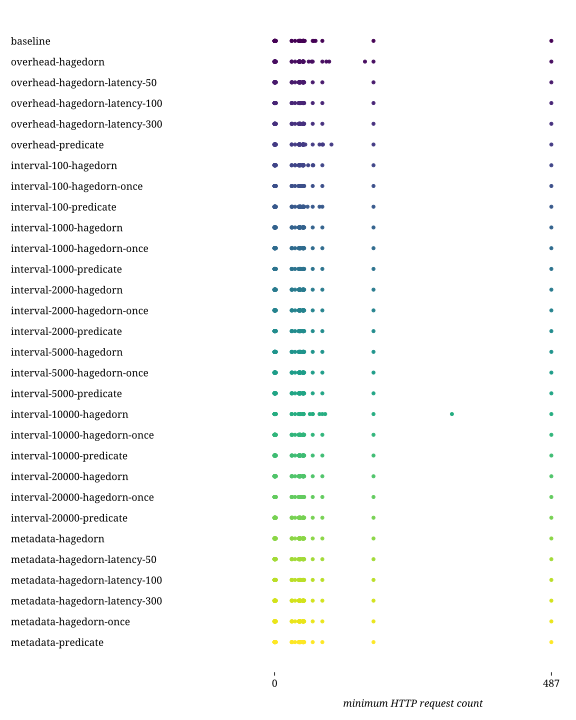

## Combinations

| Combination | Duration min (s) | Duration avg (s) | Duration max (s) | First result min (s) | First result avg (s) | First result max (s) | Last result min (s) | Last result avg (s) | Last result max (s) | dieff@full min | dieff@full avg | dieff@full max | HTTP requests | CPU-seconds (%) | GB-seconds | Network ingress (GB) | Network egress (GB) | Total results | Queries faster than baseline | Queries slower than baseline | Queries finished |
| -: | -: | -: | -: | -: | -: | -: | -: | -: | -: | -: | -: | -: | -: | -: | -: | -: | -: | -: | -: | -: | -: |
| baseline | 0.00 | 1.04 | 6.37 | 0.01 | 0.69 | 9.06 | 0.01 | 0.77 | 9.06 | 0.01 | 1.38 | 17.74 | 54 | 48909 | 6507 | 4 | 0 | 383 | 0 | 0 | 64 / 75 |
| overhead-hagedorn | 0.00 | 0.97 | 6.50 | 0.01 | 0.32 | 1.50 | 0.01 | 0.42 | 2.44 | 0.01 | 1.41 | 21.81 | 60 | 40822 | 5180 | 3 | 0 | 383 | 13 | 18 | 65 / 75 |
| overhead-hagedorn-latency-50 | 0.00 | 1.09 | 7.81 | 0.07 | 0.52 | 1.55 | 0.07 | 0.62 | 2.35 | 0.04 | 1.68 | 25.84 | 47 | 47114 | 5209 | 3 | 0 | 383 | 7 | 25 | 64 / 75 |
| overhead-hagedorn-latency-100 | 0.00 | 1.25 | 6.87 | 0.12 | 0.74 | 3.07 | 0.12 | 0.84 | 3.07 | 0.06 | 1.50 | 19.97 | 47 | 45185 | 5022 | 3 | 0 | 383 | 4 | 28 | 63 / 75 |
| overhead-hagedorn-latency-300 | 0.00 | 1.96 | 8.14 | 0.32 | 1.45 | 3.04 | 0.32 | 1.55 | 3.38 | 0.16 | 1.86 | 19.60 | 47 | 45860 | 5146 | 3 | 0 | 383 | 3 | 29 | 64 / 75 |
| overhead-predicate | 0.00 | 0.98 | 7.19 | 0.02 | 0.32 | 2.34 | 0.02 | 0.43 | 2.34 | 0.01 | 1.52 | 19.47 | 56 | 43089 | 5748 | 3 | 0 | 383 | 18 | 14 | 65 / 75 |
| interval-100-hagedorn | 0.00 | 1.84 | 20.11 | 0.01 | 0.61 | 21.58 | 0.01 | 0.84 | 21.58 | 0.01 | 1.81 | 19.10 | 66 | 49434 | 7605 | 3 | 0 | 387 | 18 | 14 | 63 / 75 |
| interval-100-hagedorn-once | 0.00 | 1.11 | 16.67 | 0.01 | 0.96 | 48.16 | 0.01 | 1.29 | 48.16 | 0.01 | 2.13 | 24.08 | 47 | 52371 | 7253 | 3 | 0 | 387 | 17 | 15 | 63 / 75 |
| interval-100-predicate | 0.00 | 1.68 | 18.70 | 0.01 | 0.30 | 2.88 | 0.01 | 0.49 | 2.88 | 0.01 | 1.79 | 23.92 | 65 | 45731 | 7349 | 4 | 0 | 398 | 15 | 17 | 57 / 75 |
| interval-1000-hagedorn | 0.00 | 1.60 | 18.92 | 0.01 | 0.32 | 1.72 | 0.01 | 0.58 | 8.68 | 0.01 | 1.67 | 21.46 | 60 | 47639 | 7317 | 4 | 0 | 386 | 14 | 18 | 60 / 75 |
| interval-1000-hagedorn-once | 0.00 | 1.17 | 17.39 | 0.01 | 0.33 | 2.11 | 0.01 | 0.55 | 2.40 | 0.01 | 1.63 | 18.48 | 47 | 47135 | 7047 | 4 | 0 | 386 | 11 | 21 | 61 / 75 |
| interval-1000-predicate | 0.00 | 1.18 | 18.87 | 0.01 | 0.50 | 22.42 | 0.01 | 0.69 | 22.42 | 0.01 | 1.83 | 22.75 | 47 | 45427 | 6442 | 4 | 0 | 386 | 19 | 13 | 59 / 75 |
| interval-2000-hagedorn | 0.00 | 1.10 | 16.85 | 0.01 | 0.33 | 2.82 | 0.01 | 0.55 | 2.82 | 0.01 | 1.66 | 24.19 | 47 | 45903 | 7227 | 4 | 0 | 385 | 19 | 13 | 62 / 75 |
| interval-2000-hagedorn-once | 0.00 | 1.14 | 17.69 | 0.01 | 0.37 | 5.56 | 0.01 | 0.57 | 5.56 | 0.01 | 1.57 | 16.66 | 47 | 50359 | 8048 | 4 | 0 | 385 | 18 | 14 | 64 / 75 |
| interval-2000-predicate | 0.00 | 1.11 | 15.60 | 0.02 | 0.37 | 7.37 | 0.02 | 0.59 | 7.37 | 0.01 | 1.92 | 24.73 | 47 | 46057 | 6789 | 4 | 0 | 385 | 14 | 18 | 63 / 75 |
| interval-5000-hagedorn | 0.00 | 1.15 | 16.96 | 0.02 | 0.33 | 2.62 | 0.02 | 0.58 | 5.03 | 0.01 | 1.67 | 15.83 | 47 | 46045 | 7170 | 4 | 0 | 384 | 10 | 22 | 64 / 75 |
| interval-5000-hagedorn-once | 0.00 | 1.11 | 17.01 | 0.02 | 0.32 | 1.40 | 0.02 | 0.56 | 5.04 | 0.01 | 1.71 | 23.86 | 47 | 49582 | 7675 | 4 | 0 | 384 | 20 | 12 | 63 / 75 |
| interval-5000-predicate | 0.00 | 1.65 | 18.82 | 0.01 | 0.31 | 1.19 | 0.01 | 0.54 | 5.03 | 0.01 | 1.76 | 25.17 | 65 | 48984 | 7611 | 4 | 0 | 384 | 9 | 23 | 62 / 75 |
| interval-10000-hagedorn | 0.00 | 1.71 | 16.55 | 0.01 | 0.35 | 1.61 | 0.01 | 0.70 | 10.03 | 0.01 | 1.82 | 18.48 | 93 | 51472 | 9435 | 4 | 0 | 384 | 12 | 20 | 62 / 75 |
| interval-10000-hagedorn-once | 0.00 | 1.17 | 18.55 | 0.02 | 0.58 | 31.06 | 0.02 | 0.94 | 31.06 | 0.01 | 1.86 | 15.53 | 47 | 54429 | 9674 | 4 | 0 | 384 | 15 | 17 | 61 / 75 |
| interval-10000-predicate | 0.00 | 1.29 | 17.20 | 0.01 | 0.33 | 1.69 | 0.01 | 0.70 | 10.03 | 0.01 | 1.87 | 18.52 | 51 | 49724 | 8040 | 4 | 0 | 384 | 11 | 21 | 61 / 75 |
| interval-20000-hagedorn | 0.00 | 1.14 | 18.44 | 0.01 | 0.75 | 51.52 | 0.01 | 0.86 | 51.52 | 0.01 | 1.71 | 25.76 | 47 | 52239 | 8468 | 4 | 0 | 383 | 17 | 15 | 65 / 75 |
| interval-20000-hagedorn-once | 0.00 | 1.11 | 17.02 | 0.02 | 0.33 | 2.16 | 0.02 | 0.45 | 2.96 | 0.01 | 1.50 | 18.44 | 47 | 52229 | 8394 | 4 | 0 | 383 | 14 | 18 | 62 / 75 |
| interval-20000-predicate | 0.00 | 1.13 | 17.34 | 0.01 | 0.58 | 32.06 | 0.01 | 0.69 | 32.06 | 0.01 | 1.58 | 21.90 | 47 | 52538 | 8613 | 4 | 0 | 383 | 15 | 17 | 63 / 75 |
| metadata-hagedorn | 0.00 | 1.13 | 17.46 | 0.02 | 0.54 | 11.98 | 0.02 | 0.65 | 11.98 | 0.01 | 1.64 | 23.25 | 47 | 47983 | 6883 | 3 | 0 | 383 | 15 | 17 | 61 / 75 |
| metadata-hagedorn-latency-50 | 0.00 | 1.39 | 17.07 | 0.07 | 0.67 | 6.64 | 0.07 | 0.77 | 6.64 | 0.04 | 1.65 | 25.52 | 47 | 48900 | 6465 | 3 | 0 | 383 | 5 | 27 | 64 / 75 |
| metadata-hagedorn-latency-100 | 0.00 | 1.97 | 20.29 | 0.12 | 1.17 | 32.90 | 0.12 | 1.28 | 32.90 | 0.06 | 1.89 | 19.81 | 56 | 45130 | 6568 | 3 | 0 | 383 | 4 | 28 | 63 / 75 |
| metadata-hagedorn-latency-300 | 0.00 | 2.15 | 13.20 | 0.32 | 1.50 | 3.19 | 0.32 | 1.60 | 3.42 | 0.16 | 1.72 | 13.64 | 47 | 46456 | 6966 | 3 | 0 | 383 | 3 | 29 | 63 / 75 |
| metadata-hagedorn-once | 0.00 | 1.47 | 19.41 | 0.01 | 0.40 | 9.38 | 0.01 | 0.54 | 9.38 | 0.01 | 1.80 | 22.01 | 61 | 51275 | 7375 | 4 | 0 | 383 | 15 | 17 | 64 / 75 |
| metadata-predicate | 0.00 | 1.10 | 17.43 | 0.02 | 0.50 | 24.55 | 0.02 | 0.62 | 24.55 | 0.01 | 1.69 | 22.10 | 47 | 46953 | 7050 | 3 | 0 | 389 | 18 | 13 | 56 / 75 |

## templates

## combinations

## httprequests

## diefficiency

## timestamps

## durations

## queries

## resources

