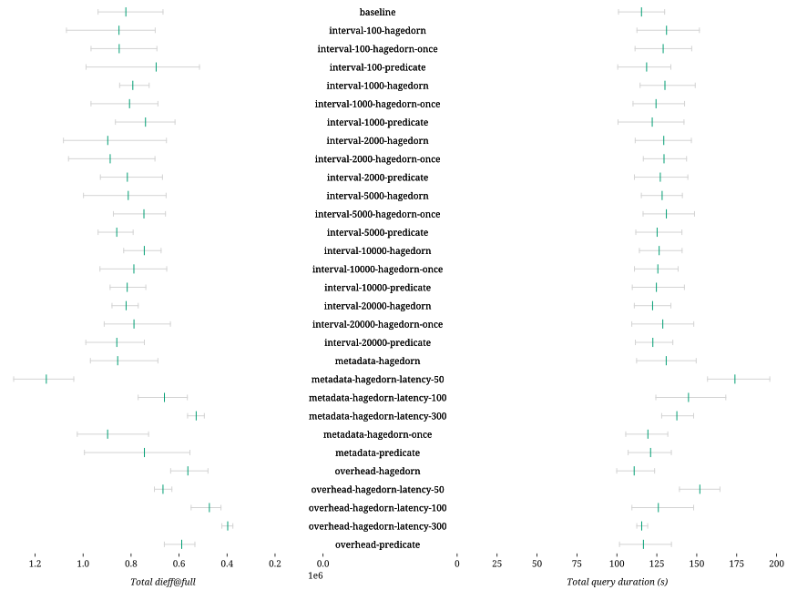

### Successful queries

| Combination | D-1 | D-2 | D-3 | D-4 | D-5 | D-6 | D-7 | D-8 | S-1 | S-2 | S-3 | S-4 | S-5 | S-6 | S-7 | Total |
| - | -: | -: | -: | -: | -: | -: | -: | -: | -: | -: | -: | -: | -: | -: | -: | -: |
| baseline | 5 | 5 | 5 | 5 | 5 | 5 | 4 | 0 | 5 | 0 | 0 | 5 | 5 | 0 | 0 | 49 |
| interval-100-hagedorn | 4 | 3 | 3 | 5 | 5 | 5 | 4 | 0 | 4 | 0 | 0 | 5 | 5 | 0 | 0 | 43 |
| interval-100-hagedorn-once | 5 | 5 | 3 | 5 | 5 | 5 | 4 | 0 | 4 | 0 | 0 | 5 | 5 | 0 | 0 | 46 |
| interval-100-predicate | 5 | 5 | 4 | 0 | 5 | 5 | 5 | 0 | 4 | 0 | 0 | 5 | 5 | 0 | 0 | 43 |
| interval-1000-hagedorn | 5 | 5 | 3 | 5 | 5 | 5 | 4 | 0 | 4 | 0 | 0 | 5 | 5 | 0 | 0 | 46 |
| interval-1000-hagedorn-once | 5 | 5 | 4 | 5 | 5 | 5 | 4 | 0 | 4 | 0 | 0 | 5 | 5 | 0 | 0 | 47 |
| interval-1000-predicate | 3 | 5 | 3 | 5 | 5 | 5 | 4 | 0 | 5 | 0 | 0 | 5 | 5 | 0 | 0 | 45 |
| interval-2000-hagedorn | 5 | 5 | 3 | 5 | 5 | 5 | 4 | 2 | 4 | 0 | 0 | 5 | 5 | 0 | 0 | 48 |
| interval-2000-hagedorn-once | 5 | 5 | 4 | 5 | 5 | 5 | 4 | 0 | 4 | 0 | 0 | 5 | 5 | 0 | 0 | 47 |
| interval-2000-predicate | 4 | 5 | 4 | 5 | 5 | 5 | 4 | 0 | 4 | 0 | 0 | 5 | 4 | 0 | 0 | 45 |
| interval-5000-hagedorn | 5 | 5 | 3 | 5 | 5 | 5 | 4 | 0 | 4 | 0 | 0 | 5 | 5 | 0 | 0 | 46 |
| interval-5000-hagedorn-once | 5 | 5 | 4 | 5 | 5 | 5 | 4 | 1 | 4 | 0 | 0 | 5 | 5 | 0 | 0 | 48 |
| interval-5000-predicate | 3 | 5 | 4 | 5 | 5 | 5 | 4 | 1 | 4 | 0 | 0 | 5 | 5 | 0 | 0 | 46 |
| interval-10000-hagedorn | 5 | 5 | 4 | 5 | 5 | 5 | 4 | 0 | 4 | 0 | 0 | 5 | 4 | 0 | 0 | 46 |
| interval-10000-hagedorn-once | 5 | 5 | 5 | 5 | 5 | 5 | 4 | 0 | 4 | 0 | 0 | 5 | 5 | 0 | 0 | 48 |
| interval-10000-predicate | 5 | 5 | 5 | 5 | 5 | 5 | 4 | 0 | 4 | 0 | 0 | 5 | 5 | 0 | 0 | 48 |
| interval-20000-hagedorn | 5 | 5 | 5 | 5 | 5 | 5 | 4 | 0 | 4 | 0 | 0 | 5 | 4 | 0 | 0 | 47 |
| interval-20000-hagedorn-once | 5 | 5 | 5 | 5 | 5 | 5 | 4 | 1 | 4 | 0 | 0 | 5 | 4 | 0 | 0 | 48 |
| interval-20000-predicate | 5 | 5 | 4 | 5 | 5 | 5 | 4 | 0 | 4 | 0 | 0 | 5 | 4 | 0 | 0 | 46 |
| metadata-hagedorn | 5 | 5 | 3 | 5 | 5 | 5 | 4 | 0 | 5 | 0 | 0 | 5 | 5 | 0 | 0 | 47 |
| metadata-hagedorn-latency-50 | 5 | 5 | 4 | 5 | 5 | 5 | 4 | 0 | 4 | 0 | 0 | 5 | 5 | 0 | 0 | 47 |
| metadata-hagedorn-latency-100 | 5 | 5 | 3 | 5 | 5 | 5 | 4 | 0 | 5 | 0 | 0 | 5 | 5 | 0 | 0 | 47 |
| metadata-hagedorn-latency-300 | 5 | 5 | 4 | 5 | 5 | 5 | 4 | 0 | 4 | 0 | 0 | 5 | 5 | 0 | 0 | 47 |
| metadata-hagedorn-once | 5 | 5 | 3 | 5 | 5 | 5 | 4 | 0 | 4 | 0 | 0 | 5 | 5 | 0 | 0 | 46 |
| metadata-predicate | 5 | 5 | 4 | 0 | 5 | 5 | 5 | 0 | 5 | 0 | 0 | 5 | 5 | 0 | 0 | 44 |
| overhead-hagedorn | 5 | 5 | 5 | 5 | 5 | 5 | 4 | 2 | 5 | 0 | 0 | 5 | 5 | 0 | 0 | 51 |
| overhead-hagedorn-latency-50 | 5 | 5 | 5 | 5 | 5 | 5 | 4 | 4 | 4 | 0 | 0 | 5 | 5 | 0 | 0 | 52 |
| overhead-hagedorn-latency-100 | 5 | 5 | 5 | 5 | 5 | 5 | 4 | 4 | 4 | 0 | 0 | 5 | 5 | 0 | 0 | 52 |
| overhead-hagedorn-latency-300 | 5 | 5 | 5 | 5 | 5 | 5 | 4 | 5 | 4 | 0 | 0 | 5 | 5 | 0 | 0 | 53 |
| overhead-predicate | 5 | 5 | 5 | 5 | 5 | 5 | 4 | 2 | 4 | 0 | 0 | 5 | 5 | 0 | 0 | 50 |

### Query processing

| Combination | Δ *dieff@full* | Δ *dieff@full* min | Δ *dieff@full* max | Δ duration | Δ duration min | Δ duration max | Δ first result | Δ first result min | Δ first result max | Δ last result | Δ last result min | Δ last result max | Queries | Results |
| - | -: | -: | -: | -: | -: | -: | -: | -: | -: | -: | -: | -: | -: | -: |
| baseline |  |  |  |  |  |  |  |  |  |  |  |  | 25 | 398 |
| interval-100-hagedorn | +3.48% | +4.87% | +14.05% | +13.57% | +11.41% | +16.74% | +1.40% | +10.32% | **-1.76**% | +6.79% | +5.53% | +8.83% | 25 | 400 |
| interval-100-hagedorn-once | +3.38% | +3.81% | +3.12% | +11.76% | +10.25% | +13.05% | +2.80% | **-3.96**% | +4.09% | +5.43% | +2.28% | +8.15% | 25 | 400 |
| interval-100-predicate | **-15.36**% | **-22.79**% | +5.34% | +2.78% | **-0.47**% | +2.99% | +27.20% | **-14.83**% | +45.78% | **-21.01**% | **-24.69**% | **-18.34**% | 25 | 401 |
| interval-1000-hagedorn | **-3.52**% | +8.66% | **-9.59**% | +12.72% | +13.37% | +14.73% | +1.87% | **-4.16**% | +11.35% | +2.27% | +0.60% | +6.06% | 25 | 400 |
| interval-1000-hagedorn-once | **-1.86**% | +3.16% | +3.14% | +7.88% | +8.99% | +9.59% | +1.45% | +5.14% | +0.73% | +3.03% | +4.84% | +3.30% | 25 | 400 |
| interval-1000-predicate | **-9.96**% | **-7.52**% | **-7.71**% | +5.83% | **-0.31**% | +9.31% | **-7.93**% | **-11.44**% | **-9.56**% | **-21.33**% | **-24.95**% | **-19.82**% | 25 | 400 |
| interval-2000-hagedorn | +9.18% | **-2.14**% | +15.40% | +12.08% | +10.35% | +12.87% | **-3.38**% | **-6.74**% | **-1.24**% | +6.26% | +5.05% | +8.00% | 25 | 400 |
| interval-2000-hagedorn-once | +7.96% | +5.02% | +13.13% | +12.21% | +15.38% | +10.54% | +3.15% | +6.69% | +2.42% | +9.40% | +11.87% | +8.83% | 25 | 400 |
| interval-2000-predicate | **-0.75**% | +0.33% | **-1.04**% | +10.20% | +9.85% | +11.15% | **-1.87**% | **-4.91**% | +1.41% | **-15.42**% | **-18.33**% | **-12.80**% | 25 | 400 |
| interval-5000-hagedorn | **-1.21**% | **-1.93**% | +6.48% | +11.19% | +14.16% | +8.54% | +3.47% | +11.38% | **-4.07**% | +9.47% | +11.71% | +6.73% | 25 | 399 |
| interval-5000-hagedorn-once | **-9.17**% | **-1.54**% | **-6.80**% | +13.49% | +15.23% | +14.39% | +7.40% | +4.72% | +15.41% | +9.95% | +9.65% | +13.73% | 25 | 399 |
| interval-5000-predicate | +4.62% | +18.66% | **-0.02**% | +8.47% | +10.73% | +8.31% | **-6.42**% | **-9.33**% | **-0.91**% | **-12.27**% | **-12.81**% | **-10.73**% | 25 | 399 |
| interval-10000-hagedorn | **-9.34**% | +1.18% | **-11.39**% | +9.57% | +12.94% | +8.40% | +1.11% | +9.23% | **-3.99**% | +11.44% | +17.32% | +8.83% | 25 | 399 |
| interval-10000-hagedorn-once | **-4.07**% | **-2.32**% | **-0.85**% | +8.87% | +9.88% | +6.49% | +4.90% | +1.63% | +5.95% | +10.99% | +10.63% | +8.19% | 25 | 399 |
| interval-10000-predicate | **-0.68**% | +10.74% | **-5.35**% | +8.08% | +8.54% | +9.51% | +5.86% | **-7.72**% | +18.82% | **-2.81**% | **-5.18**% | **-0.51**% | 25 | 399 |
| interval-20000-hagedorn | **-0.13**% | +15.49% | **-6.19**% | +6.01% | +9.79% | +3.01% | **-7.53**% | **-1.37**% | **-10.64**% | **-0.70**% | +2.63% | **-2.42**% | 25 | 398 |
| interval-20000-hagedorn-once | **-4.12**% | **-4.63**% | **-2.72**% | +11.55% | +8.24% | +14.02% | +2.29% | **-6.57**% | +8.21% | +0.93% | **-2.32**% | +2.65% | 25 | 398 |
| interval-20000-predicate | +4.58% | +11.63% | +5.44% | +6.16% | +10.44% | +3.94% | **-6.87**% | +1.23% | **-9.95**% | **-5.49**% | **-2.11**% | **-7.22**% | 25 | 398 |
| metadata-hagedorn | +4.14% | +3.18% | +3.40% | +13.40% | +11.21% | +15.19% | +10.50% | +9.90% | +18.56% | +7.10% | +5.32% | +10.11% | 25 | 398 |
| metadata-hagedorn-latency-50 | +40.35% | +55.76% | +37.50% | +50.68% | +55.16% | +50.65% | +97.23% | +110.27% | +100.19% | +57.57% | +63.44% | +58.36% | 25 | 398 |
| metadata-hagedorn-latency-100 | **-19.56**% | **-15.20**% | **-17.83**% | +25.49% | +23.15% | +29.47% | +61.78% | +67.50% | +60.43% | +31.54% | +27.22% | +36.19% | 25 | 398 |
| metadata-hagedorn-latency-300 | **-35.66**% | **-25.83**% | **-39.79**% | +19.18% | +26.76% | +13.96% | +76.16% | +100.13% | +60.22% | +22.54% | +30.41% | +17.28% | 25 | 398 |
| metadata-hagedorn-once | +9.25% | +9.02% | +9.24% | +3.47% | +4.48% | +1.51% | **-8.60**% | **-5.39**% | **-12.14**% | **-22.41**% | **-24.19**% | **-21.89**% | 25 | 398 |
| metadata-predicate | **-9.40**% | **-16.84**% | +6.07% | +4.94% | +5.97% | +3.21% | +52.89% | +63.54% | +47.19% | **-17.64**% | **-17.06**% | **-17.37**% | 25 | 398 |
| overhead-hagedorn | **-31.45**% | **-28.10**% | **-32.27**% | **-3.97**% | **-1.10**% | **-4.84**% | **-6.27**% | **-2.78**% | **-4.99**% | **-4.24**% | **-2.22**% | **-4.06**% | 25 | 398 |
| overhead-hagedorn-latency-50 | **-18.83**% | **-5.56**% | **-25.04**% | +31.65% | +37.77% | +26.66% | +75.00% | +87.05% | +68.47% | +44.03% | +50.27% | +38.75% | 25 | 398 |
| overhead-hagedorn-latency-100 | **-42.35**% | **-36.23**% | **-41.38**% | +9.13% | +8.33% | +13.97% | +59.63% | +63.25% | +64.79% | +17.70% | +15.38% | +24.63% | 25 | 398 |
| overhead-hagedorn-latency-300 | **-51.66**% | **-43.66**% | **-55.03**% | +0.11% | +11.33% | **-8.19**% | +53.87% | +79.09% | +36.96% | +5.21% | +16.63% | **-2.95**% | 25 | 398 |
| overhead-predicate | **-28.33**% | **-19.94**% | **-29.45**% | +1.04% | +0.62% | +3.27% | +5.03% | +3.03% | +12.21% | +1.55% | **-0.18**% | +6.03% | 25 | 398 |

### Network usage

| Combination | Δ HTTP requests | Δ HTTP requests min | Δ HTTP requests max | Δ total data transfer (GB) | Queries |
| - | -: | -: | -: | -: | -: |
| baseline |  |  |  |  | 25 |
| interval-100-hagedorn | +0% | +0% | +0% | **-36.91**% | 25 |
| interval-100-hagedorn-once | +0% | +0% | +0% | **-35.78**% | 25 |
| interval-100-predicate | +4% | +0% | +11% | **-38.52**% | 25 |
| interval-1000-hagedorn | +0% | +0% | +0% | **-40.26**% | 25 |
| interval-1000-hagedorn-once | +0% | +0% | +0% | **-34.98**% | 25 |
| interval-1000-predicate | +0% | +0% | +0% | **-36.16**% | 25 |
| interval-2000-hagedorn | +0% | +0% | +0% | **-37.18**% | 25 |
| interval-2000-hagedorn-once | +0% | +0% | +0% | **-35.06**% | 25 |
| interval-2000-predicate | +0% | +0% | +0% | **-37.09**% | 25 |
| interval-5000-hagedorn | +0% | +0% | +0% | **-34.90**% | 25 |
| interval-5000-hagedorn-once | +0% | +0% | +0% | **-33.97**% | 25 |
| interval-5000-predicate | +0% | +0% | +0% | **-33.39**% | 25 |
| interval-10000-hagedorn | +0% | +0% | +0% | **-32.67**% | 25 |
| interval-10000-hagedorn-once | +0% | +0% | +0% | **-32.78**% | 25 |
| interval-10000-predicate | +0% | +0% | +0% | **-34.22**% | 25 |
| interval-20000-hagedorn | +0% | +0% | +0% | **-27.13**% | 25 |
| interval-20000-hagedorn-once | +0% | +0% | +0% | **-30.44**% | 25 |
| interval-20000-predicate | +0% | +0% | +0% | **-28.84**% | 25 |
| metadata-hagedorn | +0% | +0% | +0% | **-39.27**% | 25 |
| metadata-hagedorn-latency-50 | +0% | +0% | +0% | **-47.12**% | 25 |
| metadata-hagedorn-latency-100 | +0% | +0% | +0% | **-39.46**% | 25 |
| metadata-hagedorn-latency-300 | +0% | +0% | +0% | **-38.15**% | 25 |
| metadata-hagedorn-once | +0% | +0% | +0% | **-38.88**% | 25 |
| metadata-predicate | **-0**% | **-1**% | +1% | **-35.52**% | 25 |
| overhead-hagedorn | +0% | +0% | +0% | **-8.52**% | 25 |
| overhead-hagedorn-latency-50 | +0% | +0% | +0% | **-9.31**% | 25 |
| overhead-hagedorn-latency-100 | +0% | +0% | +0% | **-8.86**% | 25 |
| overhead-hagedorn-latency-300 | +0% | +0% | +0% | **-9.86**% | 25 |
| overhead-predicate | +0% | +0% | +0% | **-13.29**% | 25 |

### Resource usage

| Combination | Δ total duration (s) | Δ total CPU-seconds (%) | Δ total GB-seconds | Queries |
| - | -: | -: | -: | -: |
| baseline |  |  |  | 75 |
| interval-100-hagedorn | **-23**% | **-37**% | **-15**% | 75 |
| interval-100-hagedorn-once | **-21**% | **-35**% | +3% | 75 |
| interval-100-predicate | **-30**% | **-52**% | **-19**% | 75 |
| interval-1000-hagedorn | **-24**% | **-39**% | **-21**% | 75 |
| interval-1000-hagedorn-once | **-24**% | **-39**% | **-8**% | 75 |
| interval-1000-predicate | **-29**% | **-48**% | **-23**% | 75 |
| interval-2000-hagedorn | **-26**% | **-41**% | **-8**% | 75 |
| interval-2000-hagedorn-once | **-23**% | **-39**% | **-6**% | 75 |
| interval-2000-predicate | **-27**% | **-47**% | **-21**% | 75 |
| interval-5000-hagedorn | **-25**% | **-40**% | **-18**% | 75 |
| interval-5000-hagedorn-once | **-23**% | **-38**% | +7% | 75 |
| interval-5000-predicate | **-27**% | **-45**% | **-17**% | 75 |
| interval-10000-hagedorn | **-23**% | **-37**% | +3% | 75 |
| interval-10000-hagedorn-once | **-26**% | **-42**% | **-15**% | 75 |
| interval-10000-predicate | **-25**% | **-42**% | **-17**% | 75 |
| interval-20000-hagedorn | **-23**% | **-37**% | **-1**% | 75 |
| interval-20000-hagedorn-once | **-23**% | **-38**% | +0% | 75 |
| interval-20000-predicate | **-22**% | **-38**% | **-3**% | 75 |
| metadata-hagedorn | **-20**% | **-35**% | **-11**% | 75 |
| metadata-hagedorn-latency-50 | **-12**% | **-39**% | **-9**% | 75 |
| metadata-hagedorn-latency-100 | **-17**% | **-37**% | **-5**% | 75 |
| metadata-hagedorn-latency-300 | **-17**% | **-37**% | **-13**% | 75 |
| metadata-hagedorn-once | **-22**% | **-33**% | +10% | 75 |
| metadata-predicate | **-29**% | **-49**% | **-21**% | 75 |
| overhead-hagedorn | **-14**% | **-6**% | +15% | 75 |
| overhead-hagedorn-latency-50 | **-8**% | **-4**% | +1% | 75 |
| overhead-hagedorn-latency-100 | **-12**% | **-5**% | **-0**% | 75 |
| overhead-hagedorn-latency-300 | **-15**% | **-2**% | **-6**% | 75 |
| overhead-predicate | **-15**% | **-9**% | **-10**% | 75 |