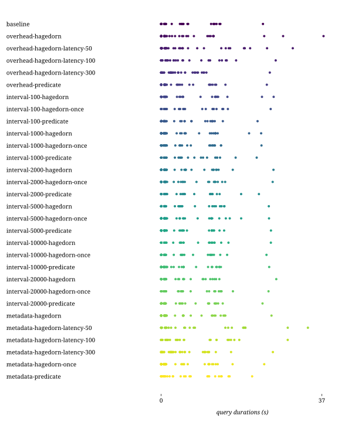
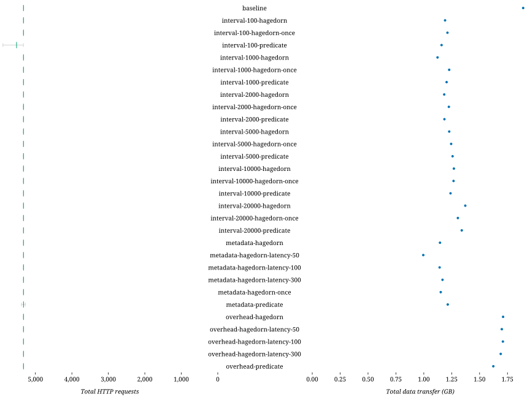

## Combinations

| Combination | Duration min (s) | Duration avg (s) | Duration max (s) | First result min (s) | First result avg (s) | First result max (s) | Last result min (s) | Last result avg (s) | Last result max (s) | dieff@full min | dieff@full avg | dieff@full max | HTTP requests | CPU-seconds (%) | GB-seconds | Network ingress (GB) | Network egress (GB) | Total results | Queries faster than baseline | Queries slower than baseline | Queries finished |
| -: | -: | -: | -: | -: | -: | -: | -: | -: | -: | -: | -: | -: | -: | -: | -: | -: | -: | -: | -: | -: | -: |
| baseline | 0.00 | 4.21 | 23.45 | 0.01 | 2.71 | 15.85 | 0.01 | 4.10 | 24.86 | 0.01 | 22.46 | 580.00 | 191 | 47509 | 3926 | 2 | 0 | 609 | 0 | 0 | 64 / 75 |
| overhead-hagedorn | 0.00 | 5.46 | 37.40 | 0.01 | 1.69 | 13.74 | 0.01 | 3.10 | 25.44 | 0.01 | 15.51 | 286.18 | 296 | 43981 | 4694 | 2 | 0 | 609 | 15 | 17 | 65 / 75 |
| overhead-hagedorn-latency-50 | 0.00 | 6.13 | 30.32 | 0.07 | 2.38 | 20.08 | 0.07 | 4.07 | 31.84 | 0.04 | 17.84 | 241.82 | 229 | 45011 | 4331 | 2 | 0 | 609 | 5 | 27 | 65 / 75 |
| overhead-hagedorn-latency-100 | 0.00 | 4.68 | 26.38 | 0.12 | 2.58 | 42.99 | 0.12 | 3.80 | 42.99 | 0.06 | 12.98 | 202.12 | 197 | 44507 | 3996 | 2 | 0 | 609 | 5 | 27 | 63 / 75 |
| overhead-hagedorn-latency-300 | 0.00 | 4.20 | 25.02 | 0.32 | 2.41 | 9.51 | 0.32 | 3.38 | 26.16 | 0.16 | 10.88 | 232.06 | 191 | 46449 | 3610 | 2 | 0 | 609 | 10 | 22 | 63 / 75 |
| overhead-predicate | 0.00 | 4.11 | 24.34 | 0.01 | 1.96 | 15.65 | 0.01 | 3.38 | 26.47 | 0.01 | 16.06 | 282.64 | 191 | 42828 | 3647 | 2 | 0 | 609 | 16 | 16 | 65 / 75 |
| interval-100-hagedorn | 0.00 | 4.91 | 25.91 | 0.01 | 2.28 | 26.18 | 0.01 | 3.85 | 28.89 | 0.01 | 23.04 | 657.72 | 200 | 29856 | 3359 | 1 | 0 | 611 | 9 | 23 | 62 / 75 |
| interval-100-hagedorn-once | 0.00 | 4.61 | 25.23 | 0.02 | 2.32 | 32.13 | 0.02 | 3.84 | 32.13 | 0.01 | 23.04 | 575.66 | 195 | 31326 | 4065 | 1 | 0 | 611 | 11 | 21 | 63 / 75 |
| interval-100-predicate | 0.00 | 4.27 | 22.21 | 0.01 | 2.72 | 21.88 | 0.01 | 3.34 | 21.88 | 0.01 | 19.24 | 660.93 | 207 | 20808 | 2527 | 1 | 0 | 612 | 17 | 15 | 56 / 75 |
| interval-1000-hagedorn | 0.00 | 4.64 | 23.03 | 0.02 | 2.46 | 21.78 | 0.02 | 3.91 | 24.16 | 0.01 | 21.63 | 479.03 | 191 | 28571 | 3050 | 1 | 0 | 611 | 13 | 19 | 62 / 75 |
| interval-1000-hagedorn-once | 0.00 | 4.36 | 23.11 | 0.02 | 2.47 | 23.98 | 0.02 | 3.96 | 24.54 | 0.01 | 22.09 | 577.77 | 191 | 28131 | 3580 | 1 | 0 | 611 | 14 | 18 | 63 / 75 |
| interval-1000-predicate | 0.00 | 4.33 | 22.01 | 0.02 | 2.33 | 24.35 | 0.02 | 3.33 | 24.35 | 0.01 | 20.36 | 516.73 | 195 | 22850 | 2505 | 1 | 0 | 611 | 15 | 17 | 60 / 75 |
| interval-2000-hagedorn | 0.00 | 4.59 | 25.87 | 0.01 | 2.18 | 19.01 | 0.01 | 3.81 | 26.94 | 0.01 | 24.59 | 673.38 | 191 | 27265 | 2968 | 1 | 0 | 611 | 12 | 20 | 62 / 75 |
| interval-2000-hagedorn-once | 0.00 | 4.53 | 25.69 | 0.01 | 2.16 | 22.30 | 0.01 | 3.80 | 26.27 | 0.01 | 24.18 | 657.61 | 195 | 28343 | 3469 | 1 | 0 | 611 | 9 | 23 | 63 / 75 |
| interval-2000-predicate | 0.00 | 4.52 | 22.52 | 0.01 | 2.21 | 21.51 | 0.01 | 3.28 | 21.51 | 0.01 | 22.19 | 597.91 | 195 | 23188 | 2573 | 1 | 0 | 611 | 14 | 18 | 62 / 75 |
| interval-5000-hagedorn | 0.00 | 4.52 | 24.80 | 0.01 | 2.32 | 17.98 | 0.01 | 3.97 | 26.15 | 0.01 | 22.16 | 596.28 | 191 | 27419 | 2809 | 1 | 0 | 610 | 12 | 20 | 64 / 75 |
| interval-5000-hagedorn-once | 0.00 | 4.73 | 24.84 | 0.01 | 2.29 | 19.73 | 0.01 | 3.87 | 27.38 | 0.00 | 20.27 | 498.04 | 204 | 29201 | 4460 | 1 | 0 | 610 | 8 | 24 | 64 / 75 |
| interval-5000-predicate | 0.00 | 4.38 | 25.29 | 0.02 | 2.01 | 27.28 | 0.02 | 3.21 | 27.28 | 0.01 | 23.31 | 558.47 | 194 | 24581 | 2768 | 1 | 0 | 610 | 15 | 17 | 62 / 75 |
| interval-10000-hagedorn | 0.00 | 4.47 | 25.27 | 0.01 | 2.12 | 24.16 | 0.01 | 3.84 | 26.96 | 0.01 | 20.38 | 460.32 | 191 | 29537 | 4403 | 1 | 0 | 610 | 12 | 20 | 63 / 75 |
| interval-10000-hagedorn-once | 0.00 | 4.37 | 24.26 | 0.01 | 1.94 | 22.30 | 0.01 | 3.62 | 25.77 | 0.00 | 21.54 | 577.25 | 191 | 26265 | 2845 | 1 | 0 | 610 | 13 | 19 | 65 / 75 |
| interval-10000-predicate | 0.00 | 4.52 | 24.88 | 0.01 | 2.50 | 25.23 | 0.01 | 3.82 | 25.23 | 0.01 | 22.38 | 539.45 | 197 | 26322 | 2919 | 1 | 0 | 610 | 14 | 18 | 65 / 75 |
| interval-20000-hagedorn | 0.00 | 4.23 | 26.51 | 0.01 | 2.40 | 23.56 | 0.01 | 3.91 | 28.44 | 0.01 | 22.52 | 519.70 | 191 | 28590 | 3742 | 1 | 0 | 609 | 17 | 15 | 63 / 75 |
| interval-20000-hagedorn-once | 0.00 | 4.53 | 24.73 | 0.01 | 2.08 | 23.80 | 0.01 | 3.49 | 27.14 | 0.01 | 21.32 | 538.86 | 191 | 27995 | 3660 | 1 | 0 | 609 | 14 | 18 | 64 / 75 |
| interval-20000-predicate | 0.00 | 4.36 | 23.35 | 0.01 | 2.32 | 25.20 | 0.01 | 3.68 | 25.20 | 0.01 | 23.41 | 635.06 | 191 | 27699 | 3463 | 1 | 0 | 609 | 18 | 14 | 63 / 75 |
| metadata-hagedorn | 0.00 | 4.76 | 25.42 | 0.01 | 2.47 | 24.71 | 0.01 | 3.97 | 27.32 | 0.01 | 23.38 | 598.97 | 191 | 31334 | 3387 | 1 | 0 | 609 | 9 | 23 | 64 / 75 |
| metadata-hagedorn-latency-50 | 0.00 | 6.71 | 33.80 | 0.07 | 2.86 | 27.41 | 0.07 | 4.66 | 35.92 | 0.04 | 30.87 | 820.64 | 197 | 30339 | 3615 | 1 | 0 | 609 | 0 | 32 | 62 / 75 |
| metadata-hagedorn-latency-100 | 0.00 | 5.28 | 29.16 | 0.12 | 2.42 | 17.76 | 0.12 | 3.94 | 34.19 | 0.06 | 17.79 | 334.38 | 191 | 30252 | 3381 | 1 | 0 | 609 | 5 | 27 | 64 / 75 |
| metadata-hagedorn-latency-300 | 0.00 | 4.97 | 25.73 | 0.32 | 2.86 | 16.22 | 0.32 | 4.02 | 28.09 | 0.16 | 14.46 | 295.24 | 191 | 29729 | 3507 | 1 | 0 | 609 | 8 | 24 | 64 / 75 |
| metadata-hagedorn-once | 0.00 | 4.51 | 23.74 | 0.01 | 2.14 | 17.89 | 0.01 | 3.12 | 17.89 | 0.01 | 24.37 | 675.45 | 191 | 33068 | 4224 | 1 | 0 | 609 | 14 | 18 | 62 / 75 |
| metadata-predicate | 0.00 | 4.78 | 20.95 | 0.01 | 2.93 | 26.16 | 0.01 | 3.37 | 26.16 | 0.01 | 20.38 | 891.33 | 222 | 21828 | 2534 | 1 | 0 | 609 | 12 | 20 | 58 / 75 |

## templates

## combinations

## httprequests

## diefficiency

## timestamps

## durations

## queries

## resources

