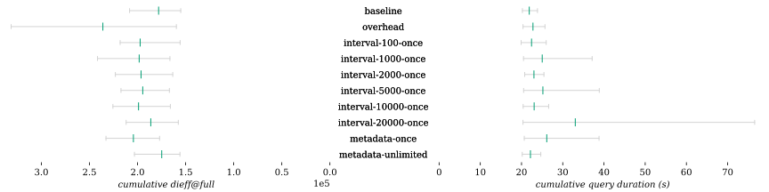

| Combination | Δ *dieff@full* | Δ *dieff@full* min | Δ *dieff@full* max | Δ duration | Δ duration min | Δ duration max | Δ first result | Δ first result min | Δ first result max | Δ last result | Δ last result min | Δ last result max | Queries |
| - | -: | -: | -: | -: | -: | -: | -: | -: | -: | -: | -: | -: | -: |
| baseline |  |  |  |  |  |  |  |  |  |  |  |  | 22 |
| overhead | **-1.32**% | +13.11% | **-1.27**% | +3.36% | +1.92% | +4.65% | +8.22% | +1.43% | +10.17% | +3.30% | +4.25% | +1.15% | 22 |
| interval-100-once | **-30.93**% | +26.60% | **-51.57**% | +1.83% | +2.10% | +4.43% | +11.78% | +4.94% | +24.49% | +3.96% | +5.39% | +6.73% | 22 |
| interval-1000-once | **-29.10**% | +19.97% | **-46.02**% | **-1.83**% | +2.34% | **-6.53**% | +0.48% | +3.13% | **-2.14**% | **-5.30**% | **-0.26**% | **-9.49**% | 22 |
| interval-2000-once | **-43.16**% | **-53.19**% | **-58.40**% | **-2.80**% | +1.72% | **-6.62**% | +5.62% | **-1.82**% | +10.76% | **-5.01**% | +0.61% | **-10.32**% | 22 |
| interval-5000-once | **-34.86**% | +23.94% | **-53.39**% | **-1.81**% | +1.85% | **-4.71**% | +6.52% | +3.41% | +11.27% | **-3.87**% | **-0.06**% | **-8.95**% | 22 |
| interval-10000-once | **-27.02**% | +26.70% | **-43.77**% | **-0.79**% | +0.23% | **-2.08**% | +2.51% | **-0.08**% | +1.07% | **-3.64**% | **-2.37**% | **-5.46**% | 22 |
| interval-20000-once | **-27.13**% | +26.40% | **-34.37**% | +0.36% | +2.80% | +0.71% | +6.49% | +4.90% | +7.37% | **-0.73**% | +1.32% | +0.62% | 22 |
| metadata-once | **-26.05**% | +12.95% | **-46.23**% | **-2.19**% | **-2.97**% | **-5.24**% | +3.84% | **-1.57**% | +5.82% | **-2.40**% | **-3.46**% | **-5.67**% | 22 |
| metadata-unlimited | **-50.05**% | **-47.70**% | **-51.34**% | **-3.52**% | +0.84% | **-10.56**% | +3.01% | +3.71% | +0.51% | +2.34% | +7.52% | **-5.71**% | 22 |
