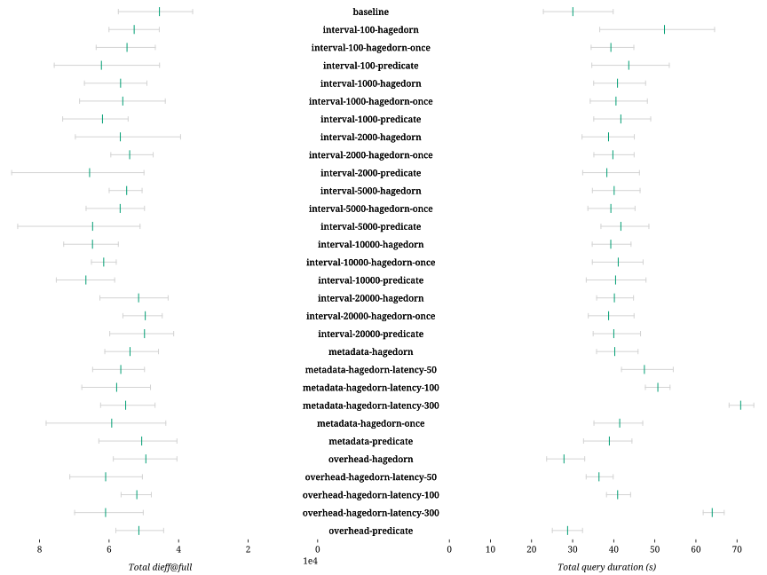
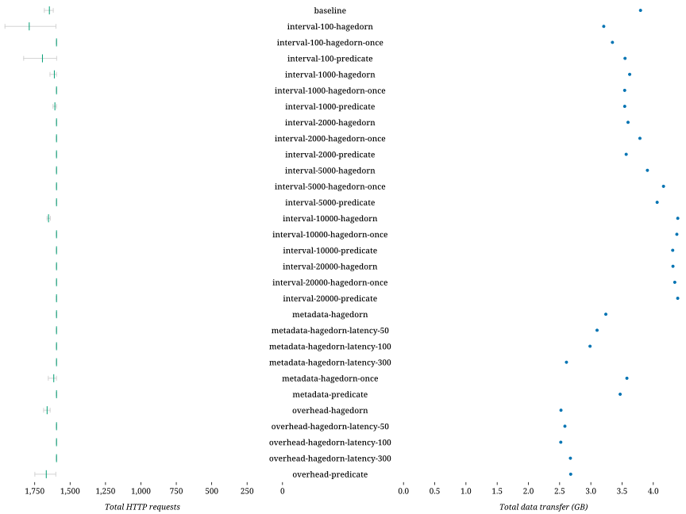

### Successful queries

| Combination | D-1 | D-2 | D-3 | D-4 | D-5 | D-6 | D-7 | D-8 | S-1 | S-2 | S-3 | S-4 | S-5 | S-6 | S-7 | Total |
| - | -: | -: | -: | -: | -: | -: | -: | -: | -: | -: | -: | -: | -: | -: | -: | -: |
| baseline-0ms | 5 | 5 | 5 | 5 | 5 | 3 | 3 | 0 | 5 | 0 | 0 | 5 | 5 | 0 | 0 | 46 |
| baseline-50ms | 5 | 5 | 5 | 5 | 5 | 3 | 3 | 0 | 5 | 0 | 0 | 5 | 5 | 0 | 0 | 46 |
| baseline-100ms | 5 | 5 | 5 | 5 | 5 | 3 | 3 | 0 | 5 | 0 | 0 | 5 | 5 | 0 | 0 | 46 |
| overhead-hagedorn-0ms | 5 | 5 | 5 | 5 | 5 | 3 | 3 | 0 | 5 | 0 | 0 | 5 | 5 | 0 | 0 | 46 |
| overhead-hagedorn-50ms | 5 | 5 | 5 | 5 | 5 | 3 | 3 | 0 | 5 | 0 | 0 | 5 | 5 | 0 | 0 | 46 |
| overhead-hagedorn-100ms | 5 | 5 | 5 | 5 | 5 | 3 | 3 | 0 | 5 | 0 | 0 | 5 | 5 | 0 | 0 | 46 |
| overhead-predicate-0ms | 5 | 5 | 5 | 5 | 5 | 3 | 3 | 0 | 5 | 0 | 0 | 5 | 5 | 0 | 0 | 46 |
| overhead-predicate-50ms | 5 | 5 | 5 | 5 | 5 | 3 | 3 | 0 | 5 | 0 | 0 | 5 | 5 | 0 | 0 | 46 |
| overhead-predicate-100ms | 5 | 5 | 5 | 5 | 5 | 3 | 3 | 1 | 5 | 0 | 0 | 5 | 5 | 0 | 0 | 47 |
| restart-100ms-hagedorn | 4 | 5 | 5 | 5 | 5 | 3 | 3 | 0 | 5 | 0 | 0 | 5 | 5 | 0 | 0 | 45 |
| restart-100ms-hagedorn-once | 5 | 5 | 5 | 4 | 5 | 3 | 3 | 0 | 5 | 0 | 0 | 5 | 5 | 0 | 0 | 45 |
| restart-100ms-predicate | 3 | 4 | 1 | 2 | 5 | 2 | 3 | 0 | 4 | 0 | 0 | 5 | 5 | 0 | 0 | 34 |
| restart-100ms-predicate-once | 4 | 4 | 5 | 5 | 5 | 3 | 3 | 0 | 5 | 0 | 0 | 5 | 5 | 0 | 0 | 44 |
| restart-1000ms-hagedorn | 5 | 5 | 3 | 5 | 5 | 3 | 3 | 0 | 5 | 0 | 0 | 5 | 3 | 0 | 0 | 42 |
| restart-1000ms-hagedorn-once | 5 | 5 | 3 | 5 | 5 | 3 | 3 | 0 | 5 | 0 | 0 | 5 | 4 | 0 | 0 | 43 |
| restart-1000ms-predicate | 5 | 5 | 3 | 5 | 5 | 3 | 3 | 0 | 5 | 0 | 0 | 5 | 4 | 0 | 0 | 43 |
| restart-1000ms-predicate-once | 5 | 5 | 4 | 5 | 5 | 3 | 3 | 0 | 4 | 0 | 0 | 5 | 3 | 0 | 0 | 42 |
| restart-10000ms-hagedorn | 5 | 5 | 5 | 5 | 5 | 3 | 3 | 0 | 4 | 0 | 0 | 5 | 5 | 0 | 0 | 45 |
| restart-10000ms-hagedorn-once | 5 | 5 | 5 | 5 | 5 | 3 | 3 | 0 | 5 | 0 | 0 | 5 | 5 | 0 | 0 | 46 |
| restart-10000ms-predicate | 5 | 5 | 5 | 5 | 5 | 3 | 3 | 0 | 4 | 0 | 0 | 5 | 5 | 0 | 0 | 45 |
| restart-10000ms-predicate-once | 5 | 5 | 5 | 5 | 5 | 3 | 3 | 0 | 5 | 0 | 0 | 5 | 5 | 0 | 0 | 46 |
| restart-update-hagedorn-0ms | 5 | 5 | 5 | 5 | 5 | 3 | 3 | 0 | 5 | 0 | 0 | 5 | 5 | 0 | 0 | 46 |
| restart-update-hagedorn-50ms | 5 | 4 | 5 | 5 | 5 | 3 | 3 | 0 | 4 | 0 | 0 | 5 | 5 | 0 | 0 | 44 |
| restart-update-hagedorn-100ms | 5 | 5 | 5 | 5 | 5 | 3 | 3 | 0 | 4 | 0 | 0 | 5 | 5 | 0 | 0 | 45 |
| restart-update-predicate-0ms | 3 | 4 | 2 | 2 | 5 | 2 | 3 | 0 | 0 | 0 | 0 | 0 | 0 | 0 | 0 | 21 |
| restart-update-predicate-50ms | 5 | 5 | 5 | 2 | 5 | 3 | 3 | 0 | 5 | 0 | 0 | 5 | 5 | 0 | 0 | 43 |
| restart-update-predicate-100ms | 5 | 5 | 5 | 3 | 5 | 3 | 3 | 0 | 4 | 0 | 0 | 5 | 5 | 0 | 0 | 43 |

### Query processing

| Combination | *dieff@full* | *dieff@full* min | *dieff@full* max | Duration | Duration min | Duration max | First result | First result min | First result max | Last result | Last result min | Last result max | Queries | Results |
| - | -: | -: | -: | -: | -: | -: | -: | -: | -: | -: | -: | -: | -: | -: |
| baseline-0ms | 24085.000 | 11114.000 | 44749.500 | 5.876 | 5.022 | 6.554 | 3.190 | 2.686 | 3.840 | 4.257 | 3.594 | 5.035 | 15 | 431 |
| baseline-50ms | 31347.700 | 21888.000 | 46781.500 | 10.630 | 10.018 | 11.204 | 7.575 | 7.068 | 8.073 | 8.723 | 8.098 | 9.474 | 15 | 431 |
| baseline-100ms | 24580.900 | 22082.000 | 27184.000 | 14.609 | 14.099 | 15.229 | 11.104 | 10.802 | 11.497 | 12.083 | 11.739 | 12.563 | 15 | 431 |
| overhead-hagedorn-0ms | 29582.600 | 20607.500 | 46505.500 | 6.211 | 5.189 | 7.042 | 3.241 | 2.587 | 4.108 | 4.497 | 3.660 | 5.559 | 15 | 431 |
| overhead-hagedorn-50ms | 35096.400 | 31871.000 | 40099.500 | 10.484 | 9.895 | 11.208 | 7.491 | 7.145 | 7.907 | 8.642 | 8.210 | 9.102 | 15 | 431 |
| overhead-hagedorn-100ms | 41205.100 | 27757.000 | 60855.000 | 14.438 | 13.804 | 15.321 | 10.972 | 10.554 | 11.570 | 12.195 | 11.675 | 12.965 | 15 | 431 |
| overhead-predicate-0ms | 32056.900 | 26161.000 | 38906.500 | 5.931 | 5.150 | 6.619 | 3.217 | 2.687 | 3.859 | 4.358 | 3.815 | 5.024 | 15 | 431 |
| overhead-predicate-50ms | 36608.700 | 29210.000 | 47990.000 | 10.504 | 9.919 | 11.127 | 7.503 | 7.099 | 7.891 | 8.716 | 8.206 | 9.266 | 15 | 431 |
| overhead-predicate-100ms | 36146.700 | 26898.500 | 50651.500 | 14.469 | 13.729 | 15.089 | 11.040 | 10.519 | 11.541 | 12.118 | 11.499 | 12.706 | 15 | 431 |
| restart-100ms-hagedorn | 29555.900 | 14940.000 | 41412.000 | 6.132 | 5.051 | 7.241 | 3.486 | 2.634 | 4.367 | 4.756 | 3.636 | 5.855 | 15 | 431 |
| restart-100ms-hagedorn-once | 32139.300 | 24554.000 | 37537.500 | 5.978 | 5.483 | 6.427 | 3.376 | 2.729 | 3.963 | 4.568 | 3.931 | 5.160 | 15 | 431 |
| restart-100ms-predicate | 29654.200 | 17392.500 | 42152.000 | 7.616 | 4.888 | 10.923 | 4.741 | 2.494 | 7.290 | 5.939 | 3.535 | 8.689 | 15 | 431 |
| restart-100ms-predicate-once | 27532.600 | 17116.500 | 46876.000 | 5.738 | 5.140 | 6.597 | 2.938 | 2.530 | 3.493 | 4.134 | 3.723 | 4.783 | 15 | 431 |
| restart-1000ms-hagedorn | 33707.700 | 18620.000 | 45336.500 | 6.187 | 5.486 | 7.041 | 3.450 | 2.848 | 4.203 | 4.731 | 3.956 | 5.614 | 15 | 431 |
| restart-1000ms-hagedorn-once | 31561.900 | 25156.500 | 41607.000 | 6.116 | 5.576 | 6.675 | 3.406 | 2.944 | 4.005 | 4.614 | 4.094 | 5.283 | 15 | 431 |
| restart-1000ms-predicate | 32297.400 | 26378.500 | 42744.000 | 6.071 | 5.451 | 6.887 | 3.516 | 2.892 | 4.240 | 4.743 | 4.058 | 5.531 | 15 | 431 |
| restart-1000ms-predicate-once | 28832.600 | 19256.000 | 38501.000 | 6.182 | 5.593 | 6.937 | 3.376 | 2.765 | 4.015 | 4.582 | 4.021 | 5.217 | 15 | 431 |
| restart-10000ms-hagedorn | 25466.500 | 17168.500 | 38912.500 | 6.497 | 5.387 | 9.356 | 3.911 | 2.773 | 6.984 | 5.031 | 3.853 | 8.128 | 15 | 431 |
| restart-10000ms-hagedorn-once | 35371.300 | 26884.000 | 46201.500 | 6.093 | 5.279 | 6.910 | 3.277 | 2.616 | 3.875 | 4.536 | 3.691 | 5.275 | 15 | 431 |
| restart-10000ms-predicate | 31858.600 | 20463.500 | 42380.000 | 5.869 | 5.040 | 6.556 | 3.266 | 2.581 | 3.893 | 4.482 | 3.795 | 5.107 | 15 | 431 |
| restart-10000ms-predicate-once | 35834.900 | 26736.000 | 45564.000 | 6.114 | 5.453 | 6.842 | 3.525 | 2.923 | 4.287 | 4.757 | 4.052 | 5.565 | 15 | 431 |
| restart-update-hagedorn-0ms | 26019.700 | 16728.000 | 35099.500 | 5.968 | 5.171 | 6.755 | 3.344 | 2.583 | 4.266 | 4.546 | 3.799 | 5.400 | 15 | 431 |
| restart-update-hagedorn-50ms | 49690.400 | 37022.500 | 64258.000 | 10.278 | 9.824 | 10.844 | 7.477 | 7.125 | 7.930 | 8.688 | 8.270 | 9.180 | 15 | 431 |
| restart-update-hagedorn-100ms | 38914.200 | 27646.500 | 65613.000 | 14.630 | 14.009 | 15.431 | 11.066 | 10.814 | 11.410 | 12.254 | 11.828 | 12.915 | 15 | 431 |
| restart-update-predicate-0ms | 35686.400 | 27793.500 | 44836.000 | 5.858 | 5.058 | 6.905 | 3.133 | 2.661 | 3.717 | 4.409 | 3.811 | 5.155 | 15 | 431 |
| restart-update-predicate-50ms | 37287.900 | 22844.500 | 53763.000 | 9.803 | 9.222 | 10.532 | 7.031 | 6.690 | 7.404 | 8.185 | 7.712 | 8.777 | 15 | 431 |
| restart-update-predicate-100ms | 37177.100 | 25941.000 | 68210.000 | 13.826 | 12.942 | 14.713 | 10.597 | 10.095 | 11.020 | 11.723 | 11.102 | 12.455 | 15 | 431 |

### Network usage

| Combination | HTTP requests | HTTP requests min | HTTP requests max | Total data transfer (GB) | Queries |
| - | -: | -: | -: | -: | -: |
| baseline-0ms | 676 | 676 | 676 | 66.170 | 15 |
| baseline-50ms | 676 | 676 | 676 | 60.881 | 15 |
| baseline-100ms | 676 | 676 | 676 | 61.086 | 15 |
| overhead-hagedorn-0ms | 676 | 676 | 676 | 56.133 | 15 |
| overhead-hagedorn-50ms | 676 | 676 | 676 | 54.899 | 15 |
| overhead-hagedorn-100ms | 676 | 676 | 676 | 51.114 | 15 |
| overhead-predicate-0ms | 676 | 676 | 676 | 55.103 | 15 |
| overhead-predicate-50ms | 676 | 676 | 676 | 53.482 | 15 |
| overhead-predicate-100ms | 676 | 676 | 676 | 52.124 | 15 |
| restart-100ms-hagedorn | 676 | 676 | 676 | 56.817 | 15 |
| restart-100ms-hagedorn-once | 676 | 676 | 676 | 54.907 | 15 |
| restart-100ms-predicate | 1100 | 676 | 1289 | 57.402 | 15 |
| restart-100ms-predicate-once | 676 | 676 | 676 | 56.827 | 15 |
| restart-1000ms-hagedorn | 676 | 676 | 676 | 54.870 | 15 |
| restart-1000ms-hagedorn-once | 676 | 676 | 676 | 54.032 | 15 |
| restart-1000ms-predicate | 676 | 676 | 676 | 58.167 | 15 |
| restart-1000ms-predicate-once | 676 | 676 | 676 | 59.786 | 15 |
| restart-10000ms-hagedorn | 676 | 676 | 676 | 63.136 | 15 |
| restart-10000ms-hagedorn-once | 676 | 676 | 676 | 66.487 | 15 |
| restart-10000ms-predicate | 676 | 676 | 676 | 63.896 | 15 |
| restart-10000ms-predicate-once | 676 | 676 | 676 | 66.591 | 15 |
| restart-update-hagedorn-0ms | 676 | 676 | 676 | 57.461 | 15 |
| restart-update-hagedorn-50ms | 676 | 676 | 676 | 57.175 | 15 |
| restart-update-hagedorn-100ms | 676 | 676 | 676 | 54.931 | 15 |
| restart-update-predicate-0ms | 676 | 676 | 676 | 8.035 | 15 |
| restart-update-predicate-50ms | 677 | 676 | 679 | 62.335 | 15 |
| restart-update-predicate-100ms | 676 | 676 | 676 | 57.457 | 15 |

### Resource usage

| Combination | Total duration (s) | Total CPU-seconds (%) | Total GB-seconds | Queries |
| - | -: | -: | -: | -: |
| baseline-0ms | 10557 | 276279 | 69666 | 75 |
| baseline-50ms | 10069 | 259260 | 52194 | 75 |
| baseline-100ms | 10652 | 273300 | 55174 | 75 |
| overhead-hagedorn-0ms | 9316 | 238707 | 48608 | 75 |
| overhead-hagedorn-50ms | 9569 | 242324 | 47329 | 75 |
| overhead-hagedorn-100ms | 9402 | 232553 | 41929 | 75 |
| overhead-predicate-0ms | 9322 | 239251 | 44191 | 75 |
| overhead-predicate-50ms | 9307 | 232870 | 43635 | 75 |
| overhead-predicate-100ms | 9810 | 240985 | 53743 | 75 |
| restart-100ms-hagedorn | 13755 | 372583 | 96510 | 75 |
| restart-100ms-hagedorn-once | 11149 | 300393 | 67632 | 75 |
| restart-100ms-predicate | 11027 | 290448 | 68276 | 75 |
| restart-100ms-predicate-once | 11582 | 301302 | 71280 | 75 |
| restart-1000ms-hagedorn | 10478 | 285111 | 61057 | 75 |
| restart-1000ms-hagedorn-once | 11559 | 301931 | 65242 | 75 |
| restart-1000ms-predicate | 12156 | 327320 | 81262 | 75 |
| restart-1000ms-predicate-once | 11319 | 298731 | 68390 | 75 |
| restart-10000ms-hagedorn | 10556 | 287507 | 64346 | 75 |
| restart-10000ms-hagedorn-once | 11864 | 315636 | 77578 | 75 |
| restart-10000ms-predicate | 11520 | 304082 | 70020 | 75 |
| restart-10000ms-predicate-once | 13214 | 353672 | 91220 | 75 |
| restart-update-hagedorn-0ms | 12977 | 351974 | 88750 | 75 |
| restart-update-hagedorn-50ms | 10847 | 288659 | 63926 | 75 |
| restart-update-hagedorn-100ms | 11331 | 305105 | 66605 | 75 |
| restart-update-predicate-0ms | 2341 | 61871 | 16025 | 75 |
| restart-update-predicate-50ms | 10145 | 269566 | 61841 | 75 |
| restart-update-predicate-100ms | 9530 | 248624 | 53306 | 75 |