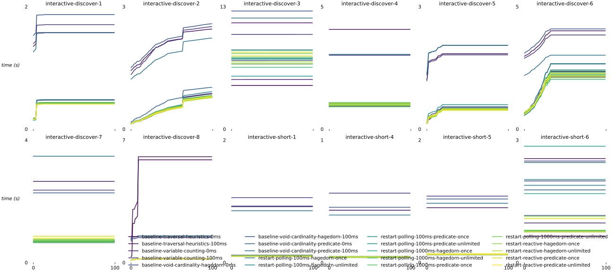
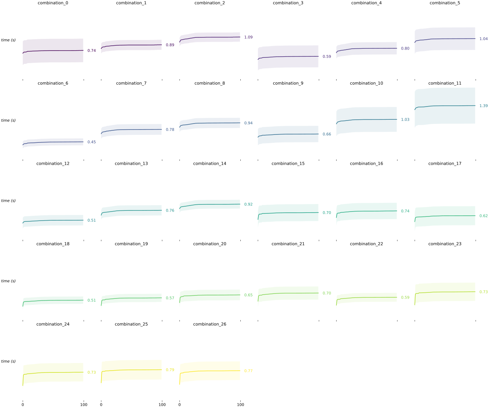
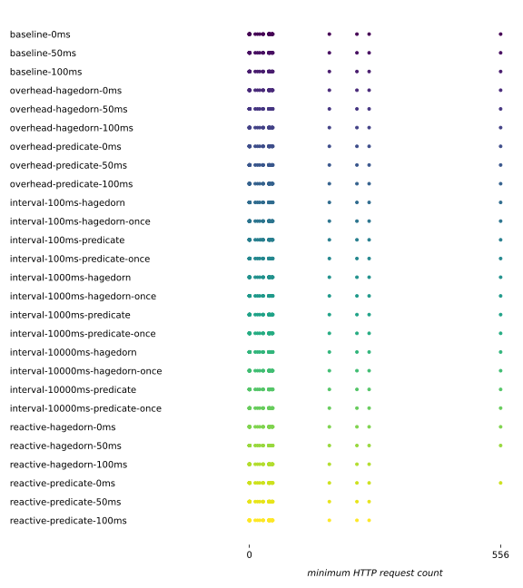
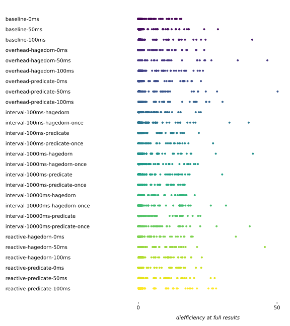
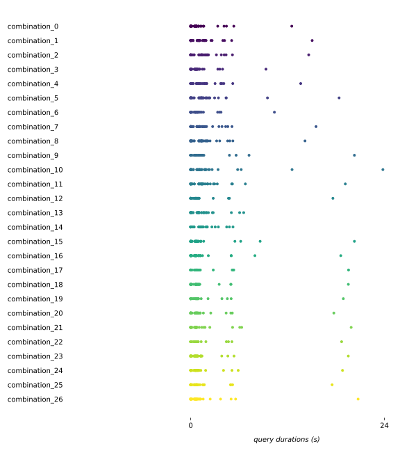
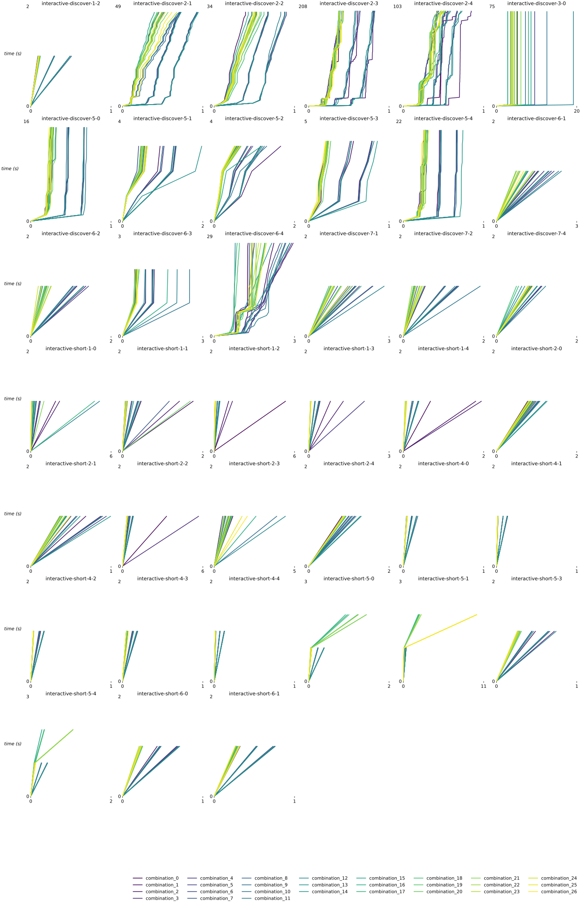

## Combinations

| Combination | Duration min (s) | Duration avg (s) | Duration max (s) | First result min (s) | First result avg (s) | First result max (s) | Last result min (s) | Last result avg (s) | Last result max (s) | dieff@full min | dieff@full avg | dieff@full max | HTTP requests | CPU-seconds (%) | GB-seconds | Network ingress (GB) | Network egress (GB) | Total results | Queries faster than baseline | Queries slower than baseline | Queries finished |
| -: | -: | -: | -: | -: | -: | -: | -: | -: | -: | -: | -: | -: | -: | -: | -: | -: | -: | -: | -: | -: | -: |
| baseline-0ms | 0.00 | 1.21 | 12.52 | 0.01 | 0.67 | 24.29 | 0.01 | 0.74 | 24.29 | 0.01 | 1.43 | 15.53 | 58 | 98967 | 4902 | 4 | 0 | 537 | 0 | 0 | 61 / 75 |
| baseline-50ms | 0.00 | 1.53 | 15.04 | 0.07 | 0.79 | 7.10 | 0.07 | 0.89 | 7.10 | 0.03 | 2.00 | 28.71 | 57 | 105770 | 5065 | 4 | 0 | 537 | 2 | 29 | 61 / 75 |
| baseline-100ms | 0.00 | 1.72 | 14.62 | 0.13 | 0.96 | 4.77 | 0.13 | 1.09 | 4.77 | 0.06 | 2.29 | 41.07 | 57 | 105574 | 5123 | 4 | 0 | 537 | 2 | 29 | 61 / 75 |
| overhead-hagedorn-0ms | 0.00 | 0.97 | 9.32 | 0.01 | 0.51 | 26.96 | 0.01 | 0.59 | 26.96 | 0.01 | 1.73 | 23.77 | 57 | 93792 | 4241 | 4 | 0 | 537 | 15 | 15 | 65 / 75 |
| overhead-hagedorn-50ms | 0.00 | 1.51 | 13.62 | 0.07 | 0.68 | 9.51 | 0.07 | 0.80 | 9.51 | 0.03 | 2.31 | 46.53 | 57 | 103993 | 4968 | 4 | 0 | 537 | 2 | 29 | 64 / 75 |
| overhead-hagedorn-100ms | 0.00 | 1.91 | 18.38 | 0.12 | 0.94 | 27.21 | 0.12 | 1.05 | 27.22 | 0.06 | 2.09 | 23.32 | 57 | 96677 | 4528 | 4 | 0 | 537 | 1 | 30 | 63 / 75 |
| overhead-predicate-0ms | 0.00 | 1.01 | 10.37 | 0.01 | 0.38 | 4.19 | 0.01 | 0.46 | 4.20 | 0.01 | 1.72 | 22.59 | 57 | 90815 | 4130 | 4 | 0 | 537 | 17 | 14 | 65 / 75 |
| overhead-predicate-50ms | 0.00 | 1.63 | 15.53 | 0.06 | 0.66 | 7.38 | 0.06 | 0.78 | 7.39 | 0.03 | 2.10 | 50.22 | 58 | 100289 | 5409 | 4 | 0 | 537 | 1 | 30 | 64 / 75 |
| overhead-predicate-100ms | 0.00 | 1.71 | 14.16 | 0.12 | 0.83 | 5.99 | 0.12 | 0.95 | 5.99 | 0.06 | 2.25 | 30.36 | 57 | 99128 | 4797 | 4 | 0 | 537 | 1 | 30 | 65 / 75 |
| interval-100ms-hagedorn | 0.00 | 1.51 | 20.28 | 0.01 | 0.53 | 13.00 | 0.01 | 0.70 | 13.00 | 0.01 | 1.74 | 22.54 | 57 | 124251 | 7022 | 6 | 0 | 540 | 14 | 17 | 59 / 75 |
| interval-100ms-hagedorn-once | 0.00 | 1.42 | 18.59 | 0.01 | 0.57 | 12.39 | 0.01 | 0.75 | 12.39 | 0.01 | 2.12 | 39.78 | 57 | 115642 | 5318 | 6 | 0 | 540 | 16 | 15 | 64 / 75 |
| interval-100ms-predicate | 0.00 | 1.27 | 19.55 | 0.01 | 0.47 | 23.51 | 0.01 | 0.62 | 23.51 | 0.01 | 1.71 | 21.83 | 57 | 117639 | 5739 | 6 | 0 | 540 | 16 | 15 | 57 / 75 |
| interval-100ms-predicate-once | 0.00 | 1.28 | 19.53 | 0.01 | 0.36 | 5.09 | 0.01 | 0.52 | 5.09 | 0.01 | 1.72 | 26.96 | 57 | 123028 | 5346 | 6 | 0 | 540 | 17 | 14 | 62 / 75 |
| interval-1000ms-hagedorn | 0.00 | 1.29 | 18.91 | 0.01 | 0.38 | 4.40 | 0.01 | 0.58 | 4.40 | 0.01 | 1.96 | 41.31 | 57 | 114213 | 5458 | 6 | 0 | 540 | 15 | 15 | 64 / 75 |
| interval-1000ms-hagedorn-once | 0.00 | 1.34 | 17.73 | 0.01 | 0.45 | 8.13 | 0.01 | 0.65 | 8.13 | 0.01 | 1.93 | 21.48 | 57 | 118133 | 5928 | 6 | 0 | 540 | 12 | 19 | 62 / 75 |
| interval-1000ms-predicate | 0.00 | 1.46 | 19.87 | 0.01 | 0.49 | 9.95 | 0.01 | 0.70 | 9.95 | 0.01 | 2.07 | 30.25 | 57 | 105550 | 4965 | 5 | 0 | 540 | 13 | 18 | 57 / 75 |
| interval-1000ms-predicate-once | 0.00 | 1.29 | 18.69 | 0.01 | 0.39 | 4.64 | 0.01 | 0.59 | 4.64 | 0.01 | 1.88 | 16.73 | 57 | 113909 | 6300 | 6 | 0 | 540 | 17 | 14 | 61 / 75 |
| interval-10000ms-hagedorn | 0.00 | 1.32 | 19.52 | 0.01 | 0.40 | 4.28 | 0.01 | 0.73 | 10.04 | 0.01 | 2.07 | 20.35 | 57 | 115929 | 5774 | 6 | 0 | 538 | 16 | 15 | 62 / 75 |
| interval-10000ms-hagedorn-once | 0.00 | 1.32 | 18.81 | 0.01 | 0.38 | 5.81 | 0.01 | 0.73 | 10.06 | 0.01 | 2.28 | 31.61 | 57 | 123752 | 6512 | 6 | 0 | 538 | 17 | 14 | 64 / 75 |
| interval-10000ms-predicate | 0.00 | 1.30 | 17.52 | 0.01 | 0.46 | 8.18 | 0.01 | 0.79 | 10.05 | 0.01 | 2.13 | 22.38 | 57 | 106782 | 5360 | 6 | 0 | 538 | 10 | 20 | 65 / 75 |
| interval-10000ms-predicate-once | 0.00 | 1.38 | 20.74 | 0.01 | 0.42 | 5.73 | 0.01 | 0.77 | 10.05 | 0.01 | 2.26 | 40.15 | 57 | 113890 | 5522 | 7 | 0 | 538 | 14 | 17 | 66 / 75 |
| reactive-hagedorn-0ms | 0.00 | 1.47 | 20.28 | 0.01 | 0.58 | 11.15 | 0.01 | 0.66 | 11.15 | 0.01 | 1.81 | 35.18 | 57 | 116860 | 5666 | 5 | 0 | 537 | 13 | 18 | 59 / 75 |
| reactive-hagedorn-50ms | 0.00 | 2.11 | 23.81 | 0.06 | 0.92 | 19.65 | 0.06 | 1.03 | 19.65 | 0.03 | 2.14 | 45.62 | 57 | 133021 | 6328 | 6 | 0 | 537 | 1 | 30 | 63 / 75 |
| reactive-hagedorn-100ms | 0.00 | 1.87 | 19.15 | 0.12 | 1.28 | 28.87 | 0.12 | 1.39 | 28.87 | 0.06 | 2.22 | 22.90 | 43 | 129378 | 7007 | 5 | 0 | 536 | 2 | 29 | 63 / 75 |
| reactive-predicate-0ms | 0.00 | 1.19 | 17.61 | 0.01 | 0.43 | 8.79 | 0.01 | 0.51 | 8.79 | 0.01 | 1.60 | 22.69 | 57 | 106584 | 5015 | 6 | 0 | 537 | 14 | 17 | 58 / 75 |
| reactive-predicate-50ms | 0.00 | 1.27 | 6.56 | 0.06 | 0.63 | 6.58 | 0.06 | 0.76 | 6.58 | 0.03 | 2.10 | 27.53 | 43 | 111373 | 5301 | 6 | 0 | 536 | 2 | 29 | 61 / 75 |
| reactive-predicate-100ms | 0.00 | 1.34 | 5.24 | 0.12 | 0.80 | 4.90 | 0.12 | 0.92 | 4.90 | 0.06 | 2.34 | 28.06 | 43 | 114029 | 5337 | 6 | 0 | 536 | 2 | 29 | 60 / 75 |

## templates

## combinations

## httprequests

## diefficiency

## timestamps

## durations

## queries

## resources

