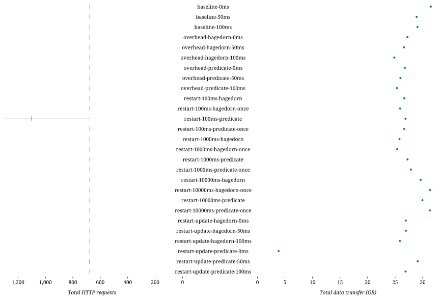

### Successful queries

| Combination | D-1 | D-2 | D-3 | D-4 | D-5 | D-6 | D-7 | D-8 | S-1 | S-2 | S-3 | S-4 | S-5 | S-6 | S-7 | Total |
| - | -: | -: | -: | -: | -: | -: | -: | -: | -: | -: | -: | -: | -: | -: | -: | -: |
| baseline-0ms | 5 | 5 | 5 | 5 | 5 | 3 | 3 | 3 | 5 | 0 | 0 | 5 | 5 | 0 | 0 | 49 |
| baseline-50ms | 5 | 5 | 5 | 5 | 5 | 3 | 3 | 2 | 5 | 0 | 0 | 5 | 5 | 0 | 0 | 48 |
| baseline-100ms | 5 | 5 | 5 | 5 | 5 | 3 | 3 | 3 | 5 | 0 | 0 | 5 | 5 | 0 | 0 | 49 |
| overhead-hagedorn-0ms | 5 | 5 | 5 | 5 | 5 | 4 | 3 | 4 | 5 | 0 | 0 | 5 | 5 | 0 | 0 | 51 |
| overhead-hagedorn-50ms | 5 | 5 | 5 | 5 | 5 | 3 | 3 | 4 | 5 | 0 | 0 | 5 | 5 | 0 | 0 | 50 |
| overhead-hagedorn-100ms | 5 | 5 | 5 | 5 | 5 | 3 | 3 | 4 | 5 | 0 | 0 | 5 | 5 | 0 | 0 | 50 |
| overhead-predicate-0ms | 5 | 5 | 5 | 5 | 5 | 4 | 3 | 4 | 5 | 0 | 0 | 5 | 5 | 0 | 0 | 51 |
| overhead-predicate-50ms | 5 | 5 | 5 | 5 | 5 | 3 | 3 | 4 | 5 | 0 | 0 | 5 | 5 | 0 | 0 | 50 |
| overhead-predicate-100ms | 5 | 5 | 5 | 5 | 5 | 3 | 3 | 3 | 5 | 0 | 0 | 5 | 5 | 0 | 0 | 49 |
| restart-100ms-hagedorn | 5 | 5 | 5 | 5 | 5 | 3 | 3 | 1 | 5 | 0 | 0 | 5 | 5 | 0 | 0 | 47 |
| restart-100ms-hagedorn-once | 5 | 5 | 5 | 5 | 5 | 3 | 3 | 4 | 5 | 3 | 0 | 5 | 5 | 0 | 0 | 53 |
| restart-100ms-predicate | 5 | 5 | 5 | 4 | 5 | 4 | 3 | 2 | 5 | 0 | 0 | 5 | 5 | 0 | 0 | 48 |
| restart-100ms-predicate-once | 5 | 5 | 5 | 5 | 5 | 4 | 3 | 1 | 5 | 0 | 0 | 5 | 5 | 0 | 0 | 48 |
| restart-1000ms-hagedorn | 5 | 5 | 5 | 5 | 5 | 3 | 3 | 1 | 5 | 0 | 0 | 5 | 5 | 0 | 0 | 47 |
| restart-1000ms-hagedorn-once | 5 | 5 | 5 | 5 | 5 | 3 | 3 | 2 | 5 | 0 | 0 | 5 | 5 | 0 | 0 | 48 |
| restart-1000ms-predicate | 5 | 5 | 5 | 5 | 5 | 4 | 3 | 2 | 4 | 0 | 0 | 5 | 5 | 0 | 0 | 48 |
| restart-1000ms-predicate-once | 5 | 5 | 5 | 5 | 5 | 3 | 3 | 3 | 4 | 0 | 0 | 5 | 5 | 0 | 0 | 48 |
| restart-10000ms-hagedorn | 5 | 5 | 5 | 5 | 5 | 3 | 4 | 2 | 5 | 0 | 0 | 5 | 5 | 0 | 0 | 49 |
| restart-10000ms-hagedorn-once | 5 | 5 | 5 | 5 | 5 | 3 | 3 | 2 | 4 | 0 | 0 | 5 | 5 | 0 | 0 | 47 |
| restart-10000ms-predicate | 5 | 5 | 5 | 5 | 5 | 3 | 3 | 3 | 4 | 0 | 0 | 5 | 5 | 0 | 0 | 48 |
| restart-10000ms-predicate-once | 5 | 5 | 5 | 5 | 5 | 3 | 3 | 2 | 4 | 0 | 0 | 5 | 5 | 0 | 0 | 47 |
| restart-update-hagedorn-0ms | 5 | 5 | 5 | 5 | 5 | 3 | 3 | 1 | 5 | 0 | 0 | 5 | 5 | 0 | 0 | 47 |
| restart-update-hagedorn-50ms | 5 | 5 | 5 | 5 | 5 | 3 | 3 | 1 | 5 | 0 | 0 | 5 | 5 | 0 | 0 | 47 |
| restart-update-hagedorn-100ms | 5 | 5 | 5 | 5 | 5 | 3 | 3 | 2 | 4 | 0 | 0 | 5 | 5 | 0 | 0 | 47 |
| restart-update-predicate-0ms | 5 | 5 | 5 | 4 | 5 | 2 | 3 | 1 | 5 | 0 | 0 | 5 | 5 | 0 | 0 | 45 |
| restart-update-predicate-50ms | 5 | 5 | 5 | 3 | 5 | 5 | 3 | 3 | 5 | 0 | 0 | 5 | 5 | 0 | 0 | 49 |
| restart-update-predicate-100ms | 5 | 5 | 5 | 4 | 5 | 5 | 3 | 1 | 5 | 0 | 0 | 5 | 5 | 0 | 0 | 48 |

### Query processing

| Combination | *dieff@full* | *dieff@full* min | *dieff@full* max | Duration | Duration min | Duration max | First result | First result min | First result max | Last result | Last result min | Last result max | Queries | Results |
| - | -: | -: | -: | -: | -: | -: | -: | -: | -: | -: | -: | -: | -: | -: |
| baseline-0ms | 77129.000 | 77129.000 | 77129.000 | 86.011 | 86.011 | 86.011 | 29.412 | 29.412 | 29.412 | 31.984 | 31.984 | 31.984 | 40 | 1108 |
| baseline-50ms | 111784.500 | 111784.500 | 111784.500 | 31.233 | 31.233 | 31.233 | 21.523 | 21.523 | 21.523 | 24.605 | 24.605 | 24.605 | 40 | 1108 |
| baseline-100ms | 88963.500 | 88963.500 | 88963.500 | 41.187 | 41.187 | 41.187 | 30.365 | 30.365 | 30.365 | 33.035 | 33.035 | 33.035 | 40 | 1108 |
| overhead-hagedorn-0ms | 83284.500 | 83284.500 | 83284.500 | 61.382 | 61.382 | 61.382 | 47.588 | 47.588 | 47.588 | 50.459 | 50.459 | 50.459 | 40 | 1108 |
| overhead-hagedorn-50ms | 88274.000 | 88274.000 | 88274.000 | 32.625 | 32.625 | 32.625 | 21.592 | 21.592 | 21.592 | 24.146 | 24.146 | 24.146 | 40 | 1108 |
| overhead-hagedorn-100ms | 102145.500 | 102145.500 | 102145.500 | 44.134 | 44.134 | 44.134 | 31.507 | 31.507 | 31.507 | 34.433 | 34.433 | 34.433 | 40 | 1108 |
| overhead-predicate-0ms | 109667.500 | 109667.500 | 109667.500 | 79.505 | 79.505 | 79.505 | 69.833 | 69.833 | 69.833 | 72.801 | 72.801 | 72.801 | 40 | 1108 |
| overhead-predicate-50ms | 93022.000 | 93022.000 | 93022.000 | 39.992 | 39.992 | 39.992 | 26.542 | 26.542 | 26.542 | 29.506 | 29.506 | 29.506 | 40 | 1108 |
| overhead-predicate-100ms | 104278.500 | 104278.500 | 104278.500 | 44.986 | 44.986 | 44.986 | 31.968 | 31.968 | 31.968 | 34.999 | 34.999 | 34.999 | 40 | 1108 |
| restart-100ms-hagedorn | 56531.500 | 56531.500 | 56531.500 | 26.427 | 26.427 | 26.427 | 17.917 | 17.917 | 17.917 | 22.747 | 22.747 | 22.747 | 40 | 1113 |
| restart-100ms-hagedorn-once | 79724.000 | 79724.000 | 79724.000 | 26.819 | 26.819 | 26.819 | 17.261 | 17.261 | 17.261 | 22.524 | 22.524 | 22.524 | 40 | 1113 |
| restart-100ms-predicate | 86264.000 | 86264.000 | 86264.000 | 23.220 | 23.220 | 23.220 | 14.695 | 14.695 | 14.695 | 20.184 | 20.184 | 20.184 | 40 | 1069 |
| restart-100ms-predicate-once | 50603.000 | 50603.000 | 50603.000 | 18.054 | 18.054 | 18.054 | 9.661 | 9.661 | 9.661 | 13.888 | 13.888 | 13.888 | 40 | 1117 |
| restart-1000ms-hagedorn | 77323.000 | 77323.000 | 77323.000 | 20.573 | 20.573 | 20.573 | 12.004 | 12.004 | 12.004 | 16.264 | 16.264 | 16.264 | 40 | 1109 |
| restart-1000ms-hagedorn-once | 89332.000 | 89332.000 | 89332.000 | 22.764 | 22.764 | 22.764 | 13.490 | 13.490 | 13.490 | 18.126 | 18.126 | 18.126 | 40 | 1109 |
| restart-1000ms-predicate | 84054.500 | 84054.500 | 84054.500 | 21.597 | 21.597 | 21.597 | 12.021 | 12.021 | 12.021 | 16.929 | 16.929 | 16.929 | 40 | 1109 |
| restart-1000ms-predicate-once | 78799.500 | 78799.500 | 78799.500 | 21.566 | 21.566 | 21.566 | 12.851 | 12.851 | 12.851 | 17.015 | 17.015 | 17.015 | 40 | 1109 |
| restart-10000ms-hagedorn | 82005.500 | 82005.500 | 82005.500 | 21.354 | 21.354 | 21.354 | 12.721 | 12.721 | 12.721 | 16.011 | 16.011 | 16.011 | 40 | 1108 |
| restart-10000ms-hagedorn-once | 64587.000 | 64587.000 | 64587.000 | 21.356 | 21.356 | 21.356 | 12.458 | 12.458 | 12.458 | 15.264 | 15.264 | 15.264 | 40 | 1108 |
| restart-10000ms-predicate | 65211.500 | 65211.500 | 65211.500 | 21.977 | 21.977 | 21.977 | 13.058 | 13.058 | 13.058 | 16.337 | 16.337 | 16.337 | 40 | 1108 |
| restart-10000ms-predicate-once | 72255.000 | 72255.000 | 72255.000 | 22.269 | 22.269 | 22.269 | 13.336 | 13.336 | 13.336 | 16.462 | 16.462 | 16.462 | 40 | 1108 |
| restart-update-hagedorn-0ms | 94986.500 | 94986.500 | 94986.500 | 27.707 | 27.707 | 27.707 | 18.505 | 18.505 | 18.505 | 22.039 | 22.039 | 22.039 | 40 | 1108 |
| restart-update-hagedorn-50ms | 68133.500 | 68133.500 | 68133.500 | 41.649 | 41.649 | 41.649 | 30.338 | 30.338 | 30.338 | 32.965 | 32.965 | 32.965 | 40 | 1108 |
| restart-update-hagedorn-100ms | 110061.000 | 110061.000 | 110061.000 | 53.446 | 53.446 | 53.446 | 40.410 | 40.410 | 40.410 | 43.278 | 43.278 | 43.278 | 40 | 1108 |
| restart-update-predicate-0ms | 98049.000 | 98049.000 | 98049.000 | 20.231 | 20.231 | 20.231 | 11.100 | 11.100 | 11.100 | 14.490 | 14.490 | 14.490 | 40 | 1073 |
| restart-update-predicate-50ms | 116739.500 | 116739.500 | 116739.500 | 28.777 | 28.777 | 28.777 | 18.088 | 18.088 | 18.088 | 21.735 | 21.735 | 21.735 | 40 | 1122 |
| restart-update-predicate-100ms | 111371.000 | 111371.000 | 111371.000 | 38.746 | 38.746 | 38.746 | 26.291 | 26.291 | 26.291 | 29.280 | 29.280 | 29.280 | 40 | 1116 |

### Network usage

| Combination | HTTP requests | HTTP requests min | HTTP requests max | Total data transfer (GB) | Queries |
| - | -: | -: | -: | -: | -: |
| baseline-0ms | 9374 | 9374 | 9374 | 13.431 | 40 |
| baseline-50ms | 2760 | 2760 | 2760 | 11.747 | 40 |
| baseline-100ms | 2760 | 2760 | 2760 | 12.885 | 40 |
| overhead-hagedorn-0ms | 7954 | 7954 | 7954 | 12.008 | 40 |
| overhead-hagedorn-50ms | 2760 | 2760 | 2760 | 10.525 | 40 |
| overhead-hagedorn-100ms | 2760 | 2760 | 2760 | 10.699 | 40 |
| overhead-predicate-0ms | 8025 | 8025 | 8025 | 11.631 | 40 |
| overhead-predicate-50ms | 4468 | 4468 | 4468 | 10.763 | 40 |
| overhead-predicate-100ms | 2760 | 2760 | 2760 | 10.359 | 40 |
| restart-100ms-hagedorn | 2760 | 2760 | 2760 | 10.244 | 40 |
| restart-100ms-hagedorn-once | 2760 | 2760 | 2760 | 7.427 | 40 |
| restart-100ms-predicate | 3149 | 3149 | 3149 | 9.821 | 40 |
| restart-100ms-predicate-once | 2760 | 2760 | 2760 | 10.821 | 40 |
| restart-1000ms-hagedorn | 2760 | 2760 | 2760 | 10.077 | 40 |
| restart-1000ms-hagedorn-once | 2760 | 2760 | 2760 | 10.447 | 40 |
| restart-1000ms-predicate | 2760 | 2760 | 2760 | 11.436 | 40 |
| restart-1000ms-predicate-once | 2760 | 2760 | 2760 | 9.988 | 40 |
| restart-10000ms-hagedorn | 2760 | 2760 | 2760 | 12.122 | 40 |
| restart-10000ms-hagedorn-once | 2760 | 2760 | 2760 | 13.495 | 40 |
| restart-10000ms-predicate | 2760 | 2760 | 2760 | 12.449 | 40 |
| restart-10000ms-predicate-once | 2760 | 2760 | 2760 | 13.000 | 40 |
| restart-update-hagedorn-0ms | 2760 | 2760 | 2760 | 10.454 | 40 |
| restart-update-hagedorn-50ms | 2760 | 2760 | 2760 | 10.081 | 40 |
| restart-update-hagedorn-100ms | 2760 | 2760 | 2760 | 9.822 | 40 |
| restart-update-predicate-0ms | 2760 | 2760 | 2760 | 12.944 | 40 |
| restart-update-predicate-50ms | 2760 | 2760 | 2760 | 10.746 | 40 |
| restart-update-predicate-100ms | 2760 | 2760 | 2760 | 11.820 | 40 |

### Resource usage

| Combination | Total duration (s) | Total CPU-seconds (%) | Total GB-seconds | Queries |
| - | -: | -: | -: | -: |
| baseline-0ms | 2119 | 57120 | 13502 | 75 |
| baseline-50ms | 1897 | 48516 | 9379 | 75 |
| baseline-100ms | 2042 | 53166 | 11049 | 75 |
| overhead-hagedorn-0ms | 1857 | 48179 | 10419 | 75 |
| overhead-hagedorn-50ms | 1988 | 52601 | 12481 | 75 |
| overhead-hagedorn-100ms | 1894 | 47598 | 9990 | 75 |
| overhead-predicate-0ms | 2020 | 51542 | 12156 | 75 |
| overhead-predicate-50ms | 1865 | 47167 | 9486 | 75 |
| overhead-predicate-100ms | 1822 | 45379 | 7744 | 75 |
| restart-100ms-hagedorn | 2570 | 67928 | 20013 | 75 |
| restart-100ms-hagedorn-once | 1506 | 38456 | 7163 | 75 |
| restart-100ms-predicate | 1922 | 50107 | 10078 | 75 |
| restart-100ms-predicate-once | 2012 | 53046 | 11073 | 75 |
| restart-1000ms-hagedorn | 1986 | 52831 | 10592 | 75 |
| restart-1000ms-hagedorn-once | 1959 | 51500 | 10413 | 75 |
| restart-1000ms-predicate | 2643 | 69094 | 17395 | 75 |
| restart-1000ms-predicate-once | 2062 | 52332 | 11400 | 75 |
| restart-10000ms-hagedorn | 2036 | 54914 | 11613 | 75 |
| restart-10000ms-hagedorn-once | 3371 | 91708 | 30030 | 75 |
| restart-10000ms-predicate | 2115 | 56449 | 11438 | 75 |
| restart-10000ms-predicate-once | 2304 | 63177 | 14243 | 75 |
| restart-update-hagedorn-0ms | 2538 | 66072 | 14824 | 75 |
| restart-update-hagedorn-50ms | 1980 | 52643 | 9864 | 75 |
| restart-update-hagedorn-100ms | 2175 | 58356 | 12869 | 75 |
| restart-update-predicate-0ms | 2693 | 73241 | 19173 | 75 |
| restart-update-predicate-50ms | 1796 | 47811 | 11009 | 75 |
| restart-update-predicate-100ms | 2132 | 57796 | 12857 | 75 |