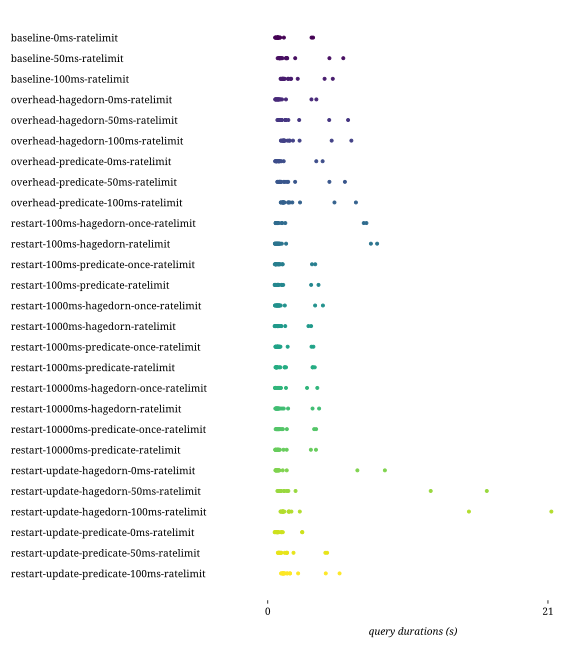

## Combinations

| Combination | Duration min (s) | Duration avg (s) | Duration max (s) | First result min (s) | First result avg (s) | First result max (s) | Last result min (s) | Last result avg (s) | Last result max (s) | dieff@full min | dieff@full avg | dieff@full max | HTTP requests | CPU-seconds (%) | GB-seconds | Network ingress (GB) | Network egress (GB) | Total results | Queries faster than baseline | Queries slower than baseline | Queries finished |
| -: | -: | -: | -: | -: | -: | -: | -: | -: | -: | -: | -: | -: | -: | -: | -: | -: | -: | -: | -: | -: | -: |
| baseline-0ms | 0.23 | 0.49 | 1.39 | 0.06 | 0.32 | 1.52 | 0.06 | 0.38 | 1.52 | 0.03 | 1.57 | 32.00 | 62 | 213936 | 53865 | 31 | 2 | 637 | 0 | 0 | 55 / 75 |
| baseline-0ms-ratelimit | 0.55 | 1.09 | 3.40 | 0.07 | 0.63 | 5.44 | 0.07 | 0.78 | 5.44 | 0.04 | 3.28 | 24.70 | 62 | 84232 | 14821 | 7 | 0 | 637 | 0 | 16 | 60 / 75 |
| baseline-50ms | 0.50 | 0.82 | 1.73 | 0.28 | 0.63 | 1.86 | 0.28 | 0.70 | 1.86 | 0.14 | 2.05 | 23.54 | 62 | 203679 | 41663 | 29 | 2 | 637 | 0 | 16 | 54 / 75 |
| baseline-50ms-ratelimit | 0.74 | 1.64 | 5.66 | 0.27 | 1.13 | 6.43 | 0.27 | 1.26 | 6.43 | 0.14 | 3.14 | 23.59 | 62 | 86675 | 14518 | 6 | 0 | 637 | 0 | 16 | 59 / 75 |
| baseline-100ms | 0.76 | 1.09 | 2.16 | 0.47 | 0.87 | 2.44 | 0.47 | 0.93 | 2.45 | 0.24 | 1.63 | 10.70 | 62 | 217614 | 44029 | 29 | 1 | 637 | 0 | 16 | 57 / 75 |
| baseline-100ms-ratelimit | 0.96 | 1.75 | 4.87 | 0.46 | 1.25 | 5.53 | 0.46 | 1.38 | 5.53 | 0.23 | 2.93 | 19.48 | 62 | 86566 | 14537 | 6 | 0 | 637 | 0 | 16 | 61 / 75 |
| overhead-hagedorn-0ms | 0.24 | 0.55 | 1.79 | 0.06 | 0.36 | 2.28 | 0.06 | 0.44 | 2.28 | 0.03 | 1.94 | 20.81 | 62 | 193236 | 38892 | 27 | 1 | 637 | 1 | 15 | 57 / 75 |
| overhead-hagedorn-0ms-ratelimit | 0.56 | 1.13 | 3.64 | 0.07 | 0.67 | 4.83 | 0.08 | 0.80 | 4.83 | 0.04 | 3.32 | 19.19 | 62 | 83170 | 13921 | 6 | 0 | 637 | 0 | 16 | 66 / 75 |
| overhead-hagedorn-50ms | 0.50 | 0.86 | 2.22 | 0.26 | 0.67 | 2.39 | 0.26 | 0.74 | 2.39 | 0.13 | 2.31 | 24.69 | 62 | 198438 | 40711 | 27 | 1 | 637 | 0 | 16 | 61 / 75 |
| overhead-hagedorn-50ms-ratelimit | 0.72 | 1.67 | 6.02 | 0.27 | 1.14 | 7.02 | 0.27 | 1.28 | 7.02 | 0.13 | 3.46 | 22.65 | 62 | 84783 | 15009 | 5 | 0 | 637 | 0 | 16 | 64 / 75 |
| overhead-hagedorn-100ms | 0.77 | 1.10 | 2.31 | 0.47 | 0.89 | 2.43 | 0.47 | 0.96 | 2.43 | 0.23 | 2.69 | 32.33 | 62 | 193274 | 36108 | 25 | 1 | 637 | 0 | 16 | 62 / 75 |
| overhead-hagedorn-100ms-ratelimit | 0.99 | 1.90 | 6.27 | 0.47 | 1.37 | 7.35 | 0.47 | 1.52 | 7.35 | 0.24 | 3.53 | 28.78 | 62 | 81989 | 14013 | 5 | 0 | 637 | 0 | 16 | 64 / 75 |
| overhead-predicate-0ms | 0.22 | 0.54 | 1.89 | 0.05 | 0.37 | 2.19 | 0.05 | 0.44 | 2.19 | 0.02 | 2.09 | 20.97 | 62 | 194024 | 37624 | 27 | 1 | 637 | 7 | 9 | 57 / 75 |
| overhead-predicate-0ms-ratelimit | 0.56 | 1.17 | 4.11 | 0.06 | 0.69 | 5.97 | 0.08 | 0.83 | 5.97 | 0.04 | 3.48 | 24.25 | 62 | 84638 | 14701 | 6 | 0 | 637 | 0 | 16 | 65 / 75 |
| overhead-predicate-50ms | 0.50 | 0.85 | 2.15 | 0.27 | 0.66 | 2.33 | 0.27 | 0.74 | 2.33 | 0.13 | 2.39 | 22.89 | 62 | 190224 | 36636 | 26 | 1 | 637 | 0 | 16 | 61 / 75 |
| overhead-predicate-50ms-ratelimit | 0.72 | 1.61 | 5.78 | 0.26 | 1.13 | 7.09 | 0.26 | 1.25 | 7.09 | 0.13 | 3.21 | 20.81 | 62 | 82441 | 15614 | 5 | 0 | 637 | 0 | 16 | 65 / 75 |
| overhead-predicate-100ms | 0.77 | 1.12 | 2.53 | 0.46 | 0.91 | 2.71 | 0.46 | 0.98 | 2.71 | 0.23 | 2.38 | 33.04 | 62 | 200461 | 42964 | 25 | 1 | 637 | 0 | 16 | 60 / 75 |
| overhead-predicate-100ms-ratelimit | 0.98 | 1.92 | 6.61 | 0.46 | 1.40 | 7.65 | 0.46 | 1.54 | 7.65 | 0.23 | 3.53 | 23.85 | 62 | 81140 | 14568 | 5 | 0 | 637 | 0 | 16 | 65 / 75 |
| restart-100ms-hagedorn | 0.24 | 0.88 | 6.37 | 0.06 | 0.71 | 6.55 | 0.07 | 0.79 | 6.55 | 0.04 | 2.10 | 24.94 | 62 | 312396 | 79242 | 27 | 2 | 637 | 3 | 13 | 57 / 75 |
| restart-100ms-hagedorn-once | 0.21 | 0.83 | 6.23 | 0.06 | 0.67 | 6.46 | 0.06 | 0.74 | 6.46 | 0.03 | 2.25 | 23.75 | 62 | 243300 | 52867 | 26 | 2 | 637 | 6 | 10 | 58 / 75 |
| restart-100ms-hagedorn-once-ratelimit | 0.59 | 1.60 | 7.40 | 0.06 | 1.13 | 13.61 | 0.08 | 1.26 | 13.62 | 0.04 | 3.41 | 18.00 | 62 | 106678 | 17897 | 8 | 0 | 637 | 0 | 16 | 64 / 75 |
| restart-100ms-hagedorn-ratelimit | 0.54 | 1.68 | 8.20 | 0.07 | 1.24 | 11.40 | 0.08 | 1.37 | 11.40 | 0.04 | 3.62 | 23.50 | 62 | 112351 | 20056 | 8 | 0 | 637 | 0 | 16 | 61 / 75 |
| restart-100ms-predicate | 0.21 | 0.56 | 2.35 | 0.05 | 0.38 | 3.91 | 0.05 | 0.45 | 3.91 | 0.03 | 1.90 | 18.25 | 88 | 229757 | 51323 | 27 | 2 | 637 | 10 | 6 | 52 / 75 |
| restart-100ms-predicate-once | 0.21 | 0.43 | 0.90 | 0.06 | 0.26 | 1.22 | 0.06 | 0.33 | 1.22 | 0.03 | 1.77 | 32.60 | 62 | 240729 | 57610 | 27 | 2 | 637 | 9 | 7 | 54 / 75 |
| restart-100ms-predicate-once-ratelimit | 0.53 | 1.10 | 3.56 | 0.07 | 0.64 | 6.44 | 0.08 | 0.77 | 6.44 | 0.04 | 3.46 | 17.66 | 62 | 109635 | 17686 | 8 | 0 | 637 | 0 | 16 | 64 / 75 |
| restart-100ms-predicate-ratelimit | 0.52 | 1.11 | 3.80 | 0.07 | 0.64 | 5.13 | 0.08 | 0.77 | 5.13 | 0.04 | 3.09 | 14.88 | 62 | 101290 | 18215 | 8 | 0 | 637 | 0 | 16 | 54 / 75 |
| restart-1000ms-hagedorn | 0.22 | 0.53 | 1.62 | 0.06 | 0.36 | 1.87 | 0.07 | 0.44 | 1.87 | 0.03 | 2.19 | 23.84 | 62 | 224702 | 46207 | 26 | 2 | 637 | 3 | 13 | 55 / 75 |
| restart-1000ms-hagedorn-once | 0.21 | 0.53 | 1.63 | 0.04 | 0.36 | 1.79 | 0.05 | 0.43 | 1.79 | 0.03 | 2.05 | 24.57 | 62 | 242955 | 51566 | 25 | 2 | 637 | 5 | 11 | 56 / 75 |
| restart-1000ms-hagedorn-once-ratelimit | 0.54 | 1.16 | 4.13 | 0.06 | 0.70 | 4.93 | 0.06 | 0.84 | 4.93 | 0.03 | 3.35 | 18.45 | 62 | 108675 | 19990 | 8 | 0 | 637 | 0 | 16 | 61 / 75 |
| restart-1000ms-hagedorn-ratelimit | 0.52 | 1.07 | 3.25 | 0.05 | 0.62 | 4.96 | 0.05 | 0.76 | 4.96 | 0.02 | 3.32 | 24.03 | 62 | 110697 | 19560 | 8 | 0 | 637 | 0 | 16 | 60 / 75 |
| restart-1000ms-predicate | 0.20 | 0.52 | 1.54 | 0.05 | 0.36 | 1.60 | 0.05 | 0.43 | 1.60 | 0.03 | 2.10 | 26.33 | 62 | 265700 | 65916 | 27 | 2 | 637 | 5 | 11 | 59 / 75 |
| restart-1000ms-predicate-once | 0.21 | 0.53 | 1.62 | 0.04 | 0.35 | 1.95 | 0.07 | 0.43 | 1.95 | 0.03 | 1.88 | 22.63 | 62 | 236727 | 54767 | 28 | 2 | 637 | 4 | 12 | 58 / 75 |
| restart-1000ms-predicate-once-ratelimit | 0.58 | 1.12 | 3.42 | 0.06 | 0.65 | 4.79 | 0.06 | 0.78 | 4.79 | 0.03 | 3.49 | 29.34 | 62 | 101542 | 17009 | 8 | 0 | 637 | 0 | 16 | 62 / 75 |
| restart-1000ms-predicate-ratelimit | 0.58 | 1.32 | 3.52 | 0.07 | 0.83 | 14.80 | 0.07 | 0.98 | 14.80 | 0.04 | 3.79 | 23.43 | 66 | 98772 | 18973 | 8 | 0 | 637 | 0 | 16 | 57 / 75 |
| restart-10000ms-hagedorn | 0.21 | 0.57 | 1.71 | 0.04 | 0.40 | 3.65 | 0.04 | 0.47 | 3.65 | 0.02 | 1.68 | 21.83 | 62 | 220080 | 48758 | 30 | 2 | 637 | 6 | 10 | 58 / 75 |
| restart-10000ms-hagedorn-once | 0.22 | 0.55 | 1.89 | 0.05 | 0.37 | 1.97 | 0.07 | 0.45 | 1.97 | 0.03 | 2.30 | 28.87 | 62 | 248495 | 59338 | 31 | 2 | 637 | 3 | 13 | 57 / 75 |
| restart-10000ms-hagedorn-once-ratelimit | 0.54 | 1.11 | 3.71 | 0.07 | 0.66 | 4.34 | 0.07 | 0.79 | 4.34 | 0.03 | 3.49 | 19.75 | 62 | 111166 | 19898 | 9 | 0 | 637 | 0 | 16 | 62 / 75 |
| restart-10000ms-hagedorn-ratelimit | 0.57 | 1.18 | 3.85 | 0.07 | 0.67 | 4.84 | 0.08 | 0.81 | 4.84 | 0.04 | 3.76 | 26.98 | 62 | 100986 | 17415 | 9 | 0 | 637 | 0 | 16 | 63 / 75 |
| restart-10000ms-predicate | 0.21 | 0.52 | 1.79 | 0.05 | 0.36 | 1.83 | 0.06 | 0.43 | 1.83 | 0.03 | 2.08 | 24.25 | 62 | 237755 | 55339 | 30 | 2 | 637 | 8 | 8 | 59 / 75 |
| restart-10000ms-predicate-once | 0.21 | 0.53 | 1.81 | 0.05 | 0.37 | 1.87 | 0.05 | 0.45 | 1.87 | 0.03 | 2.32 | 31.10 | 62 | 284735 | 71381 | 31 | 2 | 637 | 6 | 10 | 58 / 75 |
| restart-10000ms-predicate-once-ratelimit | 0.59 | 1.19 | 3.63 | 0.08 | 0.68 | 5.25 | 0.08 | 0.83 | 5.25 | 0.04 | 3.50 | 17.77 | 62 | 102244 | 17397 | 9 | 0 | 637 | 0 | 16 | 63 / 75 |
| restart-10000ms-predicate-ratelimit | 0.57 | 1.13 | 3.61 | 0.07 | 0.65 | 5.70 | 0.07 | 0.79 | 5.70 | 0.04 | 3.64 | 23.00 | 62 | 101088 | 16615 | 9 | 0 | 637 | 0 | 16 | 64 / 75 |
| restart-update-hagedorn-0ms | 0.23 | 0.84 | 6.32 | 0.05 | 0.68 | 6.37 | 0.07 | 0.75 | 6.37 | 0.03 | 1.87 | 16.92 | 62 | 290847 | 72603 | 27 | 2 | 637 | 4 | 12 | 57 / 75 |
| restart-update-hagedorn-0ms-ratelimit | 0.57 | 1.66 | 8.78 | 0.07 | 1.19 | 12.60 | 0.08 | 1.34 | 12.60 | 0.04 | 3.74 | 20.63 | 62 | 103610 | 17918 | 8 | 0 | 637 | 0 | 16 | 62 / 75 |
| restart-update-hagedorn-50ms | 0.47 | 1.08 | 4.11 | 0.26 | 0.91 | 6.68 | 0.26 | 0.98 | 6.68 | 0.13 | 3.33 | 28.85 | 62 | 229516 | 49187 | 27 | 2 | 637 | 0 | 16 | 62 / 75 |
| restart-update-hagedorn-50ms-ratelimit | 0.72 | 2.75 | 16.42 | 0.27 | 2.27 | 18.14 | 0.27 | 2.41 | 18.14 | 0.14 | 3.96 | 18.01 | 62 | 103370 | 18571 | 7 | 0 | 637 | 0 | 16 | 63 / 75 |
| restart-update-hagedorn-100ms | 0.77 | 1.60 | 6.13 | 0.46 | 1.38 | 8.52 | 0.47 | 1.45 | 8.52 | 0.23 | 2.79 | 28.81 | 62 | 246479 | 53031 | 26 | 2 | 637 | 0 | 16 | 59 / 75 |
| restart-update-hagedorn-100ms-ratelimit | 0.96 | 3.45 | 21.26 | 0.46 | 2.94 | 37.94 | 0.46 | 3.08 | 37.94 | 0.23 | 4.02 | 18.97 | 62 | 102832 | 17969 | 7 | 0 | 637 | 0 | 16 | 64 / 75 |
| restart-update-predicate-0ms | 0.24 | 0.44 | 0.90 | 0.05 | 0.27 | 1.18 | 0.08 | 0.35 | 1.18 | 0.04 | 2.27 | 25.60 | 62 | 54515 | 14316 | 4 | 0 | 637 | 6 | 10 | 25 / 75 |
| restart-update-predicate-0ms-ratelimit | 0.52 | 0.99 | 2.59 | 0.07 | 0.53 | 3.19 | 0.08 | 0.68 | 3.19 | 0.04 | 3.20 | 19.95 | 62 | 144616 | 39377 | 9 | 0 | 637 | 0 | 16 | 59 / 75 |
| restart-update-predicate-50ms | 0.50 | 0.70 | 1.15 | 0.26 | 0.53 | 1.17 | 0.26 | 0.60 | 1.17 | 0.13 | 2.38 | 24.54 | 62 | 205765 | 45913 | 29 | 2 | 637 | 1 | 15 | 57 / 75 |
| restart-update-predicate-50ms-ratelimit | 0.76 | 1.51 | 4.45 | 0.26 | 1.01 | 6.21 | 0.27 | 1.15 | 6.22 | 0.14 | 3.37 | 22.85 | 62 | 93123 | 16325 | 8 | 0 | 637 | 0 | 16 | 59 / 75 |
| restart-update-predicate-100ms | 0.77 | 0.97 | 1.48 | 0.46 | 0.77 | 1.79 | 0.47 | 0.84 | 1.79 | 0.24 | 2.39 | 34.08 | 62 | 189849 | 41207 | 27 | 2 | 637 | 0 | 16 | 57 / 75 |
| restart-update-predicate-100ms-ratelimit | 1.00 | 1.78 | 5.38 | 0.47 | 1.27 | 6.22 | 0.48 | 1.41 | 6.22 | 0.24 | 3.29 | 16.36 | 62 | 93941 | 16026 | 8 | 0 | 637 | 0 | 16 | 59 / 75 |

## templates

## combinations

## httprequests

## diefficiency

## timestamps

## durations

## queries

## templates-ratelimit

## combinations-ratelimit

## httprequests-ratelimit

## diefficiency-ratelimit

## timestamps-ratelimit

## durations-ratelimit

## queries-ratelimit

## resources

