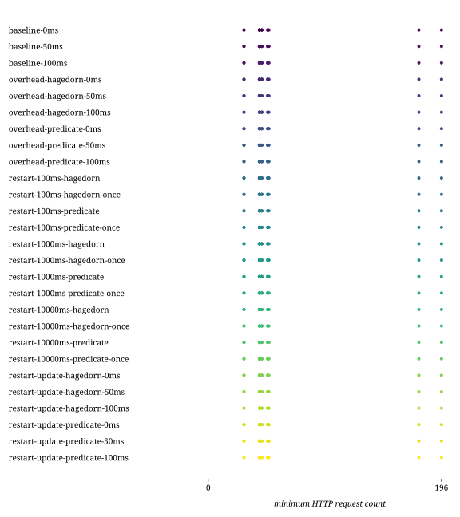

## Combinations

| Combination | Duration (s) | First result (s) | Last result (s) | dieff@full | HTTP requests | CPU-seconds (%) | GB-seconds | Network ingress (GB) | Network egress (GB) | Total results |
|:-|-:|-:|-:|-:|-:|-:|-:|-:|-:|-:|
| baseline-0ms | 0.49 | 0.32 | 0.38 | 1.57 | 61.50 | 213935.51 | 53864.90 | 31.48 | 1.61 | 637.00 |
| baseline-0ms-ratelimit | 1.09 | 0.63 | 0.78 | 3.28 | 61.50 | 84231.62 | 14820.55 | 6.89 | 0.10 | 637.00 |
| baseline-50ms | 0.82 | 0.63 | 0.70 | 2.05 | 61.50 | 203678.54 | 41662.97 | 28.90 | 1.54 | 637.00 |
| baseline-50ms-ratelimit | 1.64 | 1.13 | 1.26 | 3.14 | 61.50 | 86674.68 | 14518.28 | 6.24 | 0.09 | 637.00 |
| baseline-100ms | 1.09 | 0.87 | 0.93 | 1.63 | 61.50 | 217613.52 | 44028.94 | 29.05 | 1.50 | 637.00 |
| baseline-100ms-ratelimit | 1.75 | 1.25 | 1.38 | 2.93 | 61.50 | 86565.65 | 14537.47 | 6.11 | 0.09 | 637.00 |
| overhead-hagedorn-0ms | 0.55 | 0.36 | 0.44 | 1.94 | 61.50 | 193235.94 | 38892.02 | 27.23 | 0.84 | 637.00 |
| overhead-hagedorn-0ms-ratelimit | 1.13 | 0.67 | 0.80 | 3.32 | 61.50 | 83169.79 | 13921.25 | 5.54 | 0.09 | 637.00 |
| overhead-hagedorn-50ms | 0.86 | 0.67 | 0.74 | 2.31 | 61.50 | 198438.27 | 40711.45 | 26.60 | 0.85 | 637.00 |
| overhead-hagedorn-50ms-ratelimit | 1.67 | 1.14 | 1.28 | 3.46 | 61.50 | 84782.88 | 15008.97 | 5.31 | 0.09 | 637.00 |
| overhead-hagedorn-100ms | 1.10 | 0.89 | 0.96 | 2.69 | 61.50 | 193273.83 | 36108.33 | 24.86 | 0.70 | 637.00 |
| overhead-hagedorn-100ms-ratelimit | 1.90 | 1.37 | 1.52 | 3.53 | 61.50 | 81988.96 | 14012.82 | 5.22 | 0.09 | 637.00 |
| overhead-predicate-0ms | 0.54 | 0.37 | 0.44 | 2.09 | 61.50 | 194023.85 | 37624.33 | 26.76 | 0.80 | 637.00 |
| overhead-predicate-0ms-ratelimit | 1.17 | 0.69 | 0.83 | 3.48 | 61.50 | 84637.64 | 14700.88 | 5.53 | 0.09 | 637.00 |
| overhead-predicate-50ms | 0.85 | 0.66 | 0.74 | 2.39 | 61.50 | 190223.53 | 36636.47 | 25.96 | 0.78 | 637.00 |
| overhead-predicate-50ms-ratelimit | 1.61 | 1.13 | 1.25 | 3.21 | 61.50 | 82440.58 | 15613.77 | 5.19 | 0.09 | 637.00 |
| overhead-predicate-100ms | 1.12 | 0.91 | 0.98 | 2.38 | 61.50 | 200460.60 | 42964.05 | 25.32 | 0.74 | 637.00 |
| overhead-predicate-100ms-ratelimit | 1.92 | 1.40 | 1.54 | 3.53 | 61.50 | 81140.48 | 14567.68 | 5.30 | 0.09 | 637.00 |
| restart-100ms-hagedorn | 0.88 | 0.71 | 0.79 | 2.10 | 61.50 | 312396.45 | 79241.60 | 26.66 | 1.76 | 637.00 |
| restart-100ms-hagedorn-once | 0.83 | 0.67 | 0.74 | 2.25 | 61.50 | 243299.79 | 52867.19 | 25.90 | 1.56 | 637.00 |
| restart-100ms-hagedorn-once-ratelimit | 1.60 | 1.13 | 1.26 | 3.41 | 61.50 | 106677.97 | 17897.30 | 8.01 | 0.12 | 637.00 |
| restart-100ms-hagedorn-ratelimit | 1.68 | 1.24 | 1.37 | 3.62 | 61.50 | 112351.09 | 20055.77 | 7.83 | 0.12 | 637.00 |
| restart-100ms-predicate | 0.56 | 0.38 | 0.45 | 1.90 | 87.99 | 229757.09 | 51322.82 | 26.89 | 1.81 | 637.00 |
| restart-100ms-predicate-once | 0.43 | 0.26 | 0.33 | 1.77 | 61.50 | 240728.87 | 57610.03 | 26.65 | 1.76 | 637.00 |
| restart-100ms-predicate-once-ratelimit | 1.10 | 0.64 | 0.77 | 3.46 | 61.50 | 109634.97 | 17686.39 | 8.01 | 0.12 | 637.00 |
| restart-100ms-predicate-ratelimit | 1.11 | 0.64 | 0.77 | 3.09 | 61.64 | 101289.86 | 18215.43 | 8.38 | 0.13 | 637.00 |
| restart-1000ms-hagedorn | 0.53 | 0.36 | 0.44 | 2.19 | 61.50 | 224702.36 | 46206.59 | 25.80 | 1.64 | 637.00 |
| restart-1000ms-hagedorn-once | 0.53 | 0.36 | 0.43 | 2.05 | 61.50 | 242955.32 | 51565.84 | 25.38 | 1.64 | 637.00 |
| restart-1000ms-hagedorn-once-ratelimit | 1.16 | 0.70 | 0.84 | 3.35 | 61.50 | 108675.42 | 19989.67 | 8.21 | 0.12 | 637.00 |
| restart-1000ms-hagedorn-ratelimit | 1.07 | 0.62 | 0.76 | 3.32 | 61.50 | 110697.26 | 19560.45 | 8.23 | 0.12 | 637.00 |
| restart-1000ms-predicate | 0.52 | 0.36 | 0.43 | 2.10 | 61.50 | 265699.66 | 65915.88 | 27.25 | 1.84 | 637.00 |
| restart-1000ms-predicate-once | 0.53 | 0.35 | 0.43 | 1.88 | 61.50 | 236727.31 | 54766.70 | 27.86 | 2.03 | 637.00 |
| restart-1000ms-predicate-once-ratelimit | 1.12 | 0.65 | 0.78 | 3.49 | 61.50 | 101541.64 | 17008.61 | 8.14 | 0.12 | 637.00 |
| restart-1000ms-predicate-ratelimit | 1.32 | 0.83 | 0.98 | 3.79 | 65.58 | 98772.28 | 18972.73 | 7.95 | 0.12 | 637.00 |
| restart-10000ms-hagedorn | 0.57 | 0.40 | 0.47 | 1.68 | 61.50 | 220079.84 | 48757.69 | 29.64 | 1.93 | 637.00 |
| restart-10000ms-hagedorn-once | 0.55 | 0.37 | 0.45 | 2.30 | 61.50 | 248495.08 | 59337.73 | 31.33 | 1.92 | 637.00 |
| restart-10000ms-hagedorn-once-ratelimit | 1.11 | 0.66 | 0.79 | 3.49 | 61.50 | 111165.95 | 19897.66 | 8.55 | 0.12 | 637.00 |
| restart-10000ms-hagedorn-ratelimit | 1.18 | 0.67 | 0.81 | 3.76 | 61.50 | 100985.58 | 17415.30 | 8.58 | 0.12 | 637.00 |
| restart-10000ms-predicate | 0.52 | 0.36 | 0.43 | 2.08 | 61.50 | 237755.22 | 55339.02 | 29.96 | 1.99 | 637.00 |
| restart-10000ms-predicate-once | 0.53 | 0.37 | 0.45 | 2.32 | 61.50 | 284735.03 | 71381.04 | 31.30 | 2.00 | 637.00 |
| restart-10000ms-predicate-once-ratelimit | 1.19 | 0.68 | 0.83 | 3.50 | 61.50 | 102243.67 | 17397.47 | 8.67 | 0.12 | 637.00 |
| restart-10000ms-predicate-ratelimit | 1.13 | 0.65 | 0.79 | 3.64 | 61.50 | 101088.19 | 16615.45 | 8.67 | 0.12 | 637.00 |
| restart-update-hagedorn-0ms | 0.84 | 0.68 | 0.75 | 1.87 | 61.50 | 290847.42 | 72602.81 | 26.93 | 1.80 | 637.00 |
| restart-update-hagedorn-0ms-ratelimit | 1.66 | 1.19 | 1.34 | 3.74 | 61.50 | 103610.15 | 17918.30 | 7.66 | 0.11 | 637.00 |
| restart-update-hagedorn-50ms | 1.08 | 0.91 | 0.98 | 3.33 | 61.50 | 229516.13 | 49186.85 | 26.94 | 1.65 | 637.00 |
| restart-update-hagedorn-50ms-ratelimit | 2.75 | 2.27 | 2.41 | 3.96 | 61.50 | 103369.67 | 18571.25 | 7.23 | 0.10 | 637.00 |
| restart-update-hagedorn-100ms | 1.60 | 1.38 | 1.45 | 2.79 | 61.50 | 246479.27 | 53030.92 | 25.87 | 1.60 | 637.00 |
| restart-update-hagedorn-100ms-ratelimit | 3.45 | 2.94 | 3.08 | 4.02 | 61.50 | 102832.10 | 17969.16 | 7.09 | 0.10 | 637.00 |
| restart-update-predicate-0ms | 0.44 | 0.27 | 0.35 | 2.27 | 61.50 | 54514.54 | 14315.77 | 3.84 | 0.18 | 637.00 |
| restart-update-predicate-0ms-ratelimit | 0.99 | 0.53 | 0.68 | 3.20 | 61.50 | 144616.45 | 39376.55 | 8.53 | 0.13 | 637.00 |
| restart-update-predicate-50ms | 0.70 | 0.53 | 0.60 | 2.38 | 61.50 | 205764.86 | 45913.20 | 29.10 | 2.07 | 637.00 |
| restart-update-predicate-50ms-ratelimit | 1.51 | 1.01 | 1.15 | 3.37 | 61.50 | 93123.33 | 16324.69 | 7.59 | 0.11 | 637.00 |
| restart-update-predicate-100ms | 0.97 | 0.77 | 0.84 | 2.39 | 61.50 | 189849.21 | 41207.39 | 26.89 | 1.84 | 637.00 |
| restart-update-predicate-100ms-ratelimit | 1.78 | 1.27 | 1.41 | 3.29 | 61.50 | 93940.68 | 16025.78 | 7.57 | 0.11 | 637.00 |

## templates

## combinations

## httprequests

## diefficiency

## timestamps

## durations

## resources

