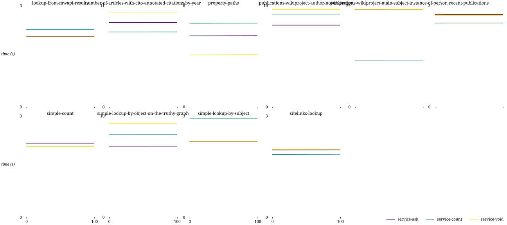
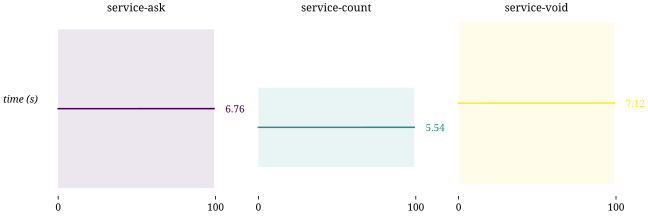
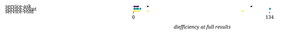
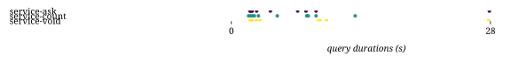
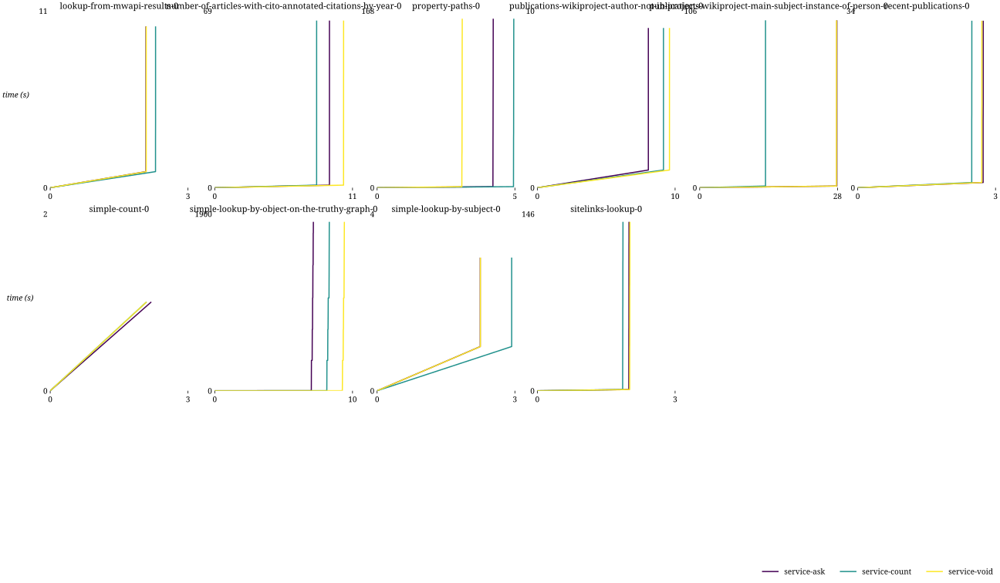
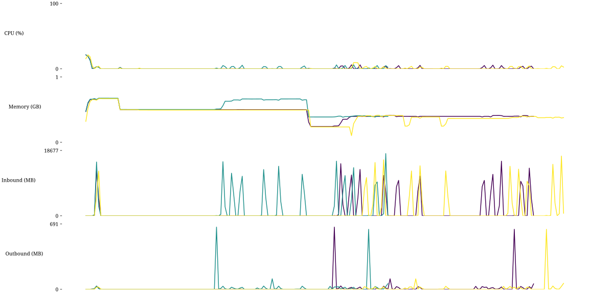

## Combinations

| Combination | Duration min (s) | Duration avg (s) | Duration max (s) | First result min (s) | First result avg (s) | First result max (s) | Last result min (s) | Last result avg (s) | Last result max (s) | dieff@full min | dieff@full avg | dieff@full max | HTTP requests | CPU-seconds (%) | GB-seconds | Network ingress (GB) | Network egress (GB) | Total results | Queries faster than baseline | Queries slower than baseline | Queries finished |
| -: | -: | -: | -: | -: | -: | -: | -: | -: | -: | -: | -: | -: | -: | -: | -: | -: | -: | -: | -: | -: | -: |
| service-ask | 2.00 | 6.77 | 27.88 | 1.99 | 6.75 | 27.87 | 2.00 | 6.77 | 27.88 | 1.04 | 14.77 | 116.07 | 2 | 144 | 94 | 0 | 0 | 2328 | 0 | 0 | 11 / 12 |
| service-count | 1.86 | 5.56 | 13.38 | 1.86 | 5.54 | 13.38 | 1.86 | 5.56 | 13.38 | 1.04 | 15.95 | 134.31 | 2 | 144 | 76 | 0 | 0 | 2328 | 0 | 0 | 11 / 12 |
| service-void | 2.02 | 7.13 | 27.80 | 2.01 | 7.11 | 27.80 | 2.02 | 7.13 | 27.80 | 1.04 | 14.00 | 107.54 | 2 | 173 | 96 | 0 | 0 | 2328 | 0 | 0 | 10 / 12 |

# Query plan observations

| Query | Name                                                     |
| ----: | :------------------------------------------------------- |
|     1 | finding-duplicated-external-ids-with-a-group-by          |
|     2 | joining-papers-and-authors                               |
|     3 | lookup-from-mwapi-results                                |
|     4 | number-of-articles-with-cito-annotated-citations-by-year |
|     5 | property-paths                                           |
|     6 | publications-wikiproject-author-not-in-project           |
|     7 | publications-wikiproject-main-subject-instance-of-person |
|     8 | recent-publications                                      |
|     9 | simple-count                                             |
|    10 | simple-lookup-by-object-on-the-truthy-graph              |
|    11 | simple-lookup-by-subject                                 |
|    12 | sitelinks-lookup                                         |

| Source assignment | Cardinality estimation | Correct sources | Finished queries | Failed |
| :---------------- | :--------------------- | --------------: | ---------------: | :----- |
| service clauses   | ASK queries            |        12 / 12  |          12 / 12 | |
|                   | COUNT queries          |        12 / 12  |          12 / 12 | |
|                   | VoID-based estimation  |        12 / 12  |          11 / 12 | 1 (timeout after full results) |
| automatic         | ASK queries            |        12 / 12  |           1 / 12 | 1 (timeout endpoint), 2 ()
|                   | COUNT queries          |           / 12  |             / 12 |
|                   | VoID-based estimation  |           / 12  |             / 12 |

Notes:

* Queries with source assignment using service clauses in the queries themselves executed successfully.
* Assigning a single source to the query itself causes the query engine to pass the full query to this source, eliminating any local query processing beyond result parsing and conversion when necessary.
* The differences between ask, count and VoID description for cardinality estimation impacted neither the performance nor the HTTP request count due to this behaviour.
* Query 2 produced no results with any of the configurations, and the absence of results was therefore considered success in the context of this analysis.
* Additionally, query 1 timed out after producing full results, which can be attributed to the Comunica query engine sometimes not terminating the execution after all results have been produced.

* With query 3, the wikibase:label and wikibase:mwapi service declarations cause Comunica to treat them as endpoint URIs.
  This is caused by the query engine not being aware of the Wikidata-specific treatment of the wikibase URIs.
  Although the source assignment is technically correct with regards to the input query, it cannot be executed this way.
* 

## templates

## combinations

## httprequests

## diefficiency

## timestamps

## durations

## queries

## resources

