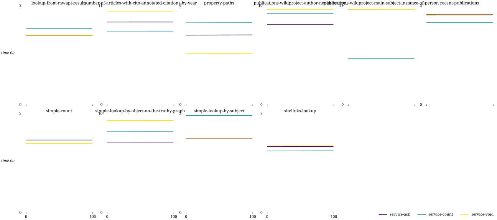
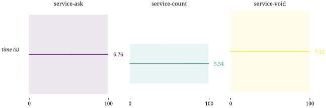
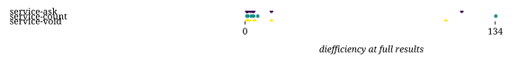
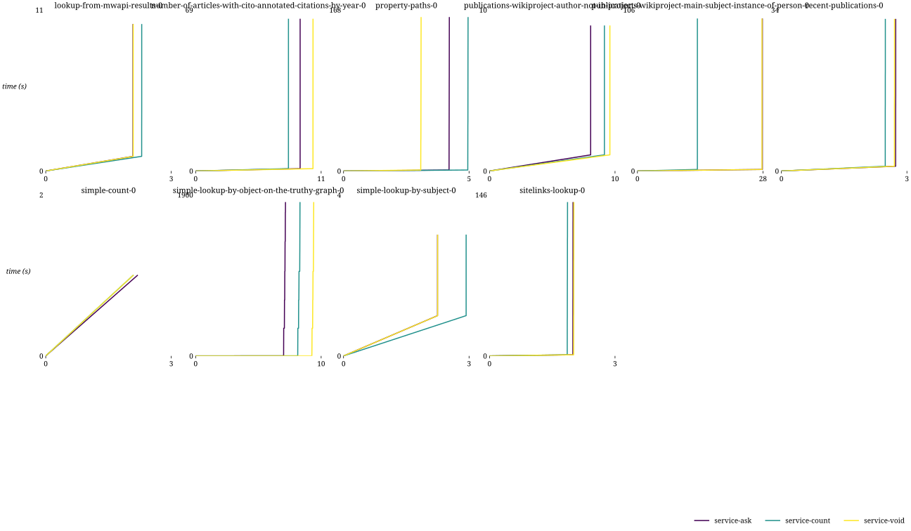
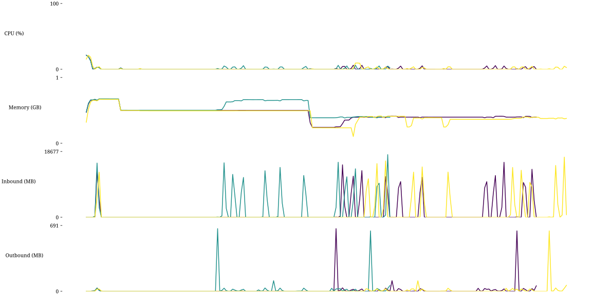

## Combinations

| Combination | Duration min (s) | Duration avg (s) | Duration max (s) | First result min (s) | First result avg (s) | First result max (s) | Last result min (s) | Last result avg (s) | Last result max (s) | dieff@full min | dieff@full avg | dieff@full max | HTTP requests | CPU-seconds (%) | GB-seconds | Network ingress (GB) | Network egress (GB) | Total results | Queries faster than baseline | Queries slower than baseline | Queries finished |
| -: | -: | -: | -: | -: | -: | -: | -: | -: | -: | -: | -: | -: | -: | -: | -: | -: | -: | -: | -: | -: | -: |
| service-ask | 2.00 | 6.77 | 27.88 | 1.99 | 6.75 | 27.87 | 2.00 | 6.77 | 27.88 | 1.04 | 14.77 | 116.07 | 2 | 144 | 94 | 0 | 0 | 2328 | 0 | 0 | 11 / 12 |
| service-count | 1.86 | 5.56 | 13.38 | 1.86 | 5.54 | 13.38 | 1.86 | 5.56 | 13.38 | 1.04 | 15.95 | 134.31 | 2 | 144 | 76 | 0 | 0 | 2328 | 0 | 0 | 11 / 12 |
| service-void | 2.02 | 7.13 | 27.80 | 2.01 | 7.11 | 27.80 | 2.02 | 7.13 | 27.80 | 1.04 | 14.00 | 107.54 | 2 | 173 | 96 | 0 | 0 | 2328 | 0 | 0 | 10 / 12 |

## templates

## combinations

## httprequests

## diefficiency

## timestamps

## durations

## queries

## resources

